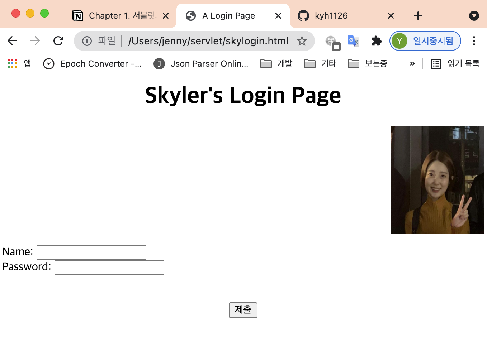

# Chapter 1. 서블릿과 JSP 는 어디에 쓰는 물건인고?

## 1. 멋진 웹사이트 개발, 모두의 희망이죠

- 웹: 많은 수의 클라이언트와 서버들이 서로 유무선 네트워크로 연결되어 있다.
    - 클라이언트: Mozilla, Safari 같은 브라우저
    - 서버: ex> Apache


## 2. 웹 서버는 어떤 일을 하나요?

- 웹 서버는 클라이언트로부터 요청을 받아, 요청한 것을 넘겨주는 일을 한다.
    - 서버: 물리적인 하드웨어 or 서버 애플리케이션 소프트웨어 전체

### Flow

---

- 사용자가 웹 브라우저로, 서버에 있는 자원(resource)을 요청
- → 요청은 웹 서버로 전달된다.
    - 요청: 요청한 것에 대한 이름과 주소(URL) 정보가 들어있다.
    - URL: 요청한 자원에 대한 주소
- → 서버는 사용자가 요청한 것을 넘겨주며 작업이 완료된다.
    - 응답: 클라이언트가 요청한 내용이 들어있다. 서버가 못찾는 경우, 오류 메시지가 대신 들어간다.

- `404 Not Found` 오류 메시지 발생: 요청한 것이 서버에 없거나 주소가 틀려 서버가 찾지 못할 경우


## 3. 그럼 클라이언트는 무엇을 하나?

- 웹 클라이언트는 사용자가 서버에 요청을 보낼 수 있는 기능을 제공한다. 요청을 보내고 난 다음, 서버가 보내온 요청의 결과를 화면에 출력하는 일도 클라이언트의 역할이다.
    - 클라이언트: 사용자 or 브라우저
    - 브라우저: 서버랑 통신하는 소프트웨어. 서버로부터 전달받은 HTML 코드를 읽어서(파싱), 화면에 보여주는 역할을 한다.


## 4. 클라이언트와 서버는 HTML 과 HTTP 를 어떻게 다룰지 압니다

- 서버는 클라이언트로 HTML 을 전송하기 위하여 HTTP 를 사용한다.

### HTML

---

- 브라우저가 화면에 내용을 표시할 방법을 지정한다.
    - 요청을 받고 나면, 서버는 브라우저에게 컨텐츠 타입이 무엇인지 알려준다.
    - 브라우저는 컨텐츠 타입에 기초하여 어떻게 화면에 출력할지 준비한다. ex> HTML 명령문

### HTTP

---

- 웹 상에서 클라이언트와 서버가 서로 대화하기 위한 규약, 언어를 지칭한다.
    - HTTP(HyperText Transfer Protocol) 프로토콜은 요청과 응답으로 이루어진 아주 단순한 구조이다.


## 5. 2분짜리 HTML 가이드

- `<!--  -->`: 주석, 코멘트
- `<a>`: 앵커(anchor)-하이퍼링크할 지점에 사용한다.
- `<align>`: 컨텐츠 정렬 방식- 좌, 우, 중앙, 양쪽 정렬
- `<body>`: 문서 몸체의 시작
- `<br>`: 줄바꿈
- `<center>`: 컨텐츠 중앙 정렬
- `<form>`: 폼 정의-입력(input) 필드를 제공한다.
- `<h1>`: 최상위 제목
- `<head>`: 문서 머리말의 시작
- `<html>`: HTML 문서의 시작
- `<input type>`: 폼에서 쓸 입력 위젯에 대한 정의
- `<p>`: 새로운 문단 시작
- `<title>`: HTML 문서 타이틀


## 6. 손이 근질근질하니, 얘기는 그만하고 코딩 좀 합시다

- 로그인 페이지

    ```html
    <html>
    <!-- Some sample HTML -->
    <head>
    	<title>A Login Page</title>
    </head>
    <body>
    <h1 align="center">Skyler's Login Page</h1>
    <p align="right">
    	
    </p>

    <form action="date2">
    	Name: <input type="text" name="param1"/><br/>
    	Password: <input type="text" name="param2"/><br/><br/><br/>

    	<center>
    		<input type="SUBMIT"/>
    	</center>
    </form>

    </body>
    </html>
    ```


## 7. 짜잔! 화면에 띄워봅시다




## 8. HTTP 프로토콜. 넌 누구냐!

- HTTP: TCP/IP 기반 위에서 돌아간다. 웹에서만 사용하는 프로토콜. TCP/IP 를 이용해서 한 지점에서 다른 지점으로 요청과 응답을 전송한다.
    - HTTP 요청의 주요 구성 요소
        - HTTP 메소드(실행할 액션)
            - GET, POST, PATCH, DELETE, OPTION, HEAD, CONNECT, TRACE
        - 접근하고자 하는 페이지(URL)
        - 폼 파라미터(메소드의 매개변수와 비슷한 놈)
    - HTTP 응답의 주요 구성 요소
        - 상태 코드(요청이 성공했는지 아닌지 등)
        - 컨텐츠 타입(텍스트, 그림, HTML 등)
        - 컨텐츠(HTML 코드, 이미지 등)

- TCP(전송 제어 프로토콜): 한쪽 노드에서 다른 쪽 노드로 파일을 보내는 녀석. 여러개로 잘라서 보낼수도 있다.
    - IP 위에서 동작하는 프로토콜
    - 데이터의 전달을 보증하고 보낸 순서대로 받게 해준다.
- IP(인터넷 프로토콜): 한 호스트에서 목적지 호스트까지 패킷을 옮기고 이동하기 위한 기반(베이스) 프로토콜
    - 패킷 전달 여부를 보증하지 않고, 패킷을 보낸 순서와 받는 순서가 다를 수 있다.


## 9. HTML 은 사실 HTTP 응답의 일부분입니다

- HTTP 응답에는 HTML 뿐만 아니라, 헤더 정보도 들어있다.
- 브라우저는 헤더 정보로 컨텐츠를 어떻게 화면에 보여줄지에 대한 힌트를 얻는다.


## 10. 내가 서버라면, 요청에 들어있는 정보 중 어떤 것이 궁금할까요?

- HTTP 프로토콜의 여러 메소드 중 가장 많이 사용하는 것은 GET, POST


## 11. 단순한 요청은 GET, 사용자가 입력한 정보를 함께 보내려면 POST

- GET: 서버로부터 뭔가를 돌려 받는다.
- POST: 서버에게 자원을 요청할 때 필요한 정보를 함께 넘겨준다.


## 12. 그게 사실이라면... HTTP GET 도 많지는 않지만 데이터를 보낼 수 있다는 말이군

- GET 보다 POST 를 사용해야 하는 경우
    1. GET 으로 보낼 수 있는 글자 수 제한 (2048자)
    2. 화면에 보이면 안되는 민감한 데이터 전송인 경우
    3. 해당 페이지를 즐겨찾기로 등록하고 싶은 경우


## 13. GET 을 해부해봅시다

- 요청 라인(Request line) 구성요소

    


## 14. POST 도 해부해봅시다

- 서버로 보내는 데이터: 메시지 몸체(Message Body) or 짐(payload)

    


## 15. HTTP 응답을 해부해봅시다. 그런데 'MIME' 타입이란 것은 무엇이죠?

- HTTP 응답은 간단히 헤더와 몸체로 구성되어 있다.
    - 헤더: 사용된 프로토콜이 뭔지, 보내준 요청이 성공했는지, 몸체에 포함된 컨텐츠 종류는 무엇인지 등
    - 몸체: HTML 같은 컨텐츠

    


## 16. 한번에 다 보도록 하지요


## 17. URL 을 '얼'이라 발음하지 마세요. '유알엘' 입니다

- URL(Uniform Resource Locators): 고유한 이름을 부여하는 방식
    - 웹 상에 있는 모든 자원은 자신만의 고유한 이름을 가진다.


- 프로토콜: 서버와 대화하기 위하여 사용하는 커뮤니케이션 프로토콜 (HTTP)
- 서버: 서버의 IP주소가 매핑되어 있는 주소
- 포트: 서버의 어떤 애플리케이션 서비스로 접근할 지 선택하는 번호
    - URL 포트가 없다면, '80'이 디폴트로 생략되어 있다. → 대부분 웹 서버 애플리케이션이 할당된다.
- Path: 서버에서 자원의 위치
- 자원: 요청한 컨텐츠의 이름 (HTML, 이미지, PDF 등등)

### TCP 포트는 단지 숫자 값일 뿐입니다

---

- 서버 하드웨어 상에서 돌아가는 소프트웨어를 구별하기 위한 16비트 숫자 값이다.
    - 서버 하드웨어에 65536개의 물리적인 포트가 있는 것은 아니고, 단순히 서버 애플리케이션을 대표하는 논리적인 숫자이다.
    - 포트로 쓸 수 있는 값의 범위: 0~65535


## 18. 아파치로 구성한 웹사이트 디렉토리 구조


## 19. 웹 서버는 정적인 페이지 서비스 가 전공입니다

- 일반적인 웹 서버는 정적인 페이지만을 지원한다. 여기서 말하는 정적인 페이지는 HTML을 의미한다.
- 동적인 페이지를 위해서 웹 어플리케이션(WAS)가 탄생한 것이다.


- 여기서 말하는 웹 서버는 Apache HTTPD 를 의미한다.
- 정적인 페이지는 디렉토리에 있는 파일 그대로를 보여준다. 서버는 단지 파일을 찾아서 있는 그대로 클라이언트에게 넘겨주기만 한다.
- 모든 클라이언트가 동일한 결과를 본다.

만약 웹 페이지에서 현재 시간을 보고싶으면 어떻게 해야할까?? 로그인은 어떻게 하지?? → 이때 필요한 것이 동적 페이지이다.


## 20. 가끔 웹 서버가 좀더 똑똑했으면 할 때가 있습니다


- 웹 서버는 동적인 로직을 수행하지 못하기 때문에, 동적인 요청이 들어오면 웹 어플리케이션 서버(WAS)에 해당 요청을 넘긴다.
- 웹 어플리케이션 서버(WAS)는 해당 로직을 수행하고, HTML 파일을 웹 서버에게 넘겨준다.
- 웹 서버는 WAS 로부터 받은 파일을 클라이언트에게 반환한다.


## 21. 웹 서버 혼자서 할 수 없는 두 가지

1. 동적인 컨텐츠 생성
    - 웹 서버는 단지 정적인 페이지만 제공한다.
    - 이때 도우미 애플리케이션-웹 어플리케이션 서버(WAS)-과 협력하면 동적인, 실시간으로 작성한 페이지를 제공할 수 있다.
2. 서버 상에 데이터 저장하기
    - 클라이언트가 HTML 폼에 데이터를 입력하고 서버에 전송을 하면, 서버는 해당 데이터를 처리하거나 저장해야 한다.
    - 이때 웹 서버는 해당 로직을 수행하지 못하기 때문에, 해당 요청을 WAS 에 부탁하게 된다.


## 22. 이런 도우미 애플리케이션을 CGI 프로그램이라고 부릅니다

- 대부분의 CGI(Common Gateway Interface) 프로그램은 펄 스크립트로 작성한다.


---


## 23. 서블릿과 CGI 는 둘 다 도우미 애플리케이션입니다

- CGI -> Servlet -> JSP → 개념 등장 순서
- CGI
    - 별도로 제작된 웹 서버와 프로그램간의 교환방식. 어떠한 프로그래밍 언어로도 구현이 가능하다.
        - 대표적으로 C, Java, Python, PHP, Ruby 등이 있다.
    - 별도로 만든 프로그램에 HTML 의 Get, Post 방법으로 클라이언트의 데이터를 환경변수로 전달하고, 프로그램의 표준 출력 결과를 클라이언트에게 전송한다. 즉, 자바 어플리케이션 코딩을 하듯 웹 브라우저용 출력 화면을 만드는 방법이다.
        - 동적인 HTML, 데이터베이스 질의 처리 등에 사용된다.
    - CGI 프로그램은 서버에서 프로세스 단위로 실행된다. 그러므로 사용자의 요청이 많을 때 서버에 부하가 크게 걸린다.
- 서블릿
    - 서블릿은 Tomcat(컨테이너)이 이해할 수 있는 순수 Java 코드로만 이루어진 웹 서버용 클래스
        - 웹페이지를 동적으로 생성하는 서버측 프로그램 혹은 그 사양을 말하며, 자바로 구현된 CGI 를 의미한다.
    - 클라이언트의 요청에 대해 동적으로 작동하는 웹 어플리케이션 컴포넌트, HTML 을 사용하여 요청에 응답하며, Java Thread 를 이용하여 동작한다.
        - 프로그램이 실행될 때 스레드 단위로 실행되어 서버의 부하를 줄이고, CGI 프로그래밍 시 직접 코드에 설정을 추가해줘야 했던 것을 없애줘 CGI 프로그래밍을 쉽게 만들었다.
        - 하지만 Java를 사용하여 웹페이지를 동적으로 생성하기 위해 코드안에 HTML 이 포함되는데, HTML형태로 출력하기 위해서는 `println()` 메소드를 사용하여 일일이 `String`으로 태그들을 양식에 맞춰 써야하므로 다른 서버사이드 언어에 비해 불편하다.
        - 또한 Java 클래스이기 때문에 테스트하기 위해서는 항상 빌드를 다시 하여 확인해야 했고, 이런 단점을 보완하기 위해 등장한 것이 jsp 이다.
    - 프로세스 단위보다 더 작은 단위로 실행하는 것이 필요했다 → 웹 서버의 프로세스로서 인터프리터를 상주시키고, CGI로부터 프로그램을 호출해 (즉, 스레드 단위로 실행) 부하를 줄임으로써 성능을 개선한 Java Servlet 이 등장했다.


## 24. 서블릿의 신비를 벗겨봅시다 (작성, 배포, 실행)


- 서블릿 class 파일 (Ch1Servlet.java)

    ```java
    import javax.servlet.*;
    import javax.servlet.http.*;
    import java.io.*;

    public class Ch1Servlet extends HttpServlet {
      public void doGet(HttpServletRequest request, HttpServletResponse response) throws IOException {
        PrintWriter out = response.getWriter();
        java.util.Date today = new java.util.Date();
        out.println("<html>"+
                "<body>"+
                "<h1 align=center>Jenny\'s Chapter1 Servlet</h1>"+
                "<br>"+ today +
                "</body>"+
                "</html>");
      }
    }
    ```


- web.xml 파일

    ```xml
    <web-app xmlns="http://java.sun.com/xml/ns/j2ee"
             xmlns:xsi="http://www.w3.org/2001/XMLSchema-instance"
             xsi:schemaLocation="http://java.sun.com/xml/ns/j2ee/web-app_2_4.xsd"
             version="2.4">
        <servlet>
            <servlet-name>Chapter1 Servlet</servlet-name>
            <servlet-class>Ch1Servlet</servlet-class>
        </servlet>
        
        <servlet-mapping>
            <servlet-name>Chapter1 Servlet</servlet-name>
            <url-pattern>/Serv1</url-pattern>
        </servlet-mapping>
    </web-app>
    ```


- 자바 컴파일
    - `javac -classpath /tomcat위치/tomcat/lib/servlet-api.jar -d classes src/Ch1Servlet.java`

    ```bash
    javac -classpath /Users/jenny/servlet/apache-tomcat-8.5.71/lib/servlet-api.jar -d classes src/Ch1Servlet.java
    ```

- class 파일 복사

    ```bash
    cd /Users/jenny/servlet/apache-tomcat-8.5.71/webapps/ch1/WEB-INF/classes
    cp ../../classes/Ch1Servlet.class .
    ```

- 톰캣 실행

    ```bash
    cd /Users/jenny/servlet/apache-tomcat-8.5.71
    bin/startup.sh
    ```


## 25. JSP 는 HTML 에 자바를 넣을 순 없을까라는 고민에서 탄생했다네요

- JSP: HTML안에 자바 코드가 포함된 것으로, 서버사이드 스크립트를 말한다.
- 자바를 HTML 에 넣으면 다음의 2가지 문제를 해결할 수 있다.
    1. HTML 페이지 디자이너들은 대부분 자바를 모른다.
    2. HTML 페이지를 자바 String 변수에 넣는 것은 악몽이다.

- 참고
    - TCP/IP: [https://brunch.co.kr/@wangho/6](https://brunch.co.kr/@wangho/6)
    - [http://pds20.egloos.com/pds/201009/07/94/Servlet_N_JSP_ch1-2.pdf](http://pds20.egloos.com/pds/201009/07/94/Servlet_N_JSP_ch1-2.pdf)
    - [https://github.com/binghe819/TIL/blob/b3c332c1eb43ffde8a3cc408a3d712fece7656cb/Spring/Servlet/Head First Servlets %26 JSP/1. 서블릿과 JSP는 어디에 쓰는 것인가%3F.md](https://github.com/binghe819/TIL/blob/b3c332c1eb43ffde8a3cc408a3d712fece7656cb/Spring/Servlet/Head%20First%20Servlets%20%26%20JSP/1.%20%EC%84%9C%EB%B8%94%EB%A6%BF%EA%B3%BC%20JSP%EB%8A%94%20%EC%96%B4%EB%94%94%EC%97%90%20%EC%93%B0%EB%8A%94%20%EA%B2%83%EC%9D%B8%EA%B0%80%3F.md)
    - CGI, 서블릿 1: [https://dlagusgh1.tistory.com/123](https://dlagusgh1.tistory.com/123)
    - CGI, 서블릿 2: [https://m.blog.naver.com/goddlaek/220901890910](https://m.blog.naver.com/goddlaek/220901890910)
