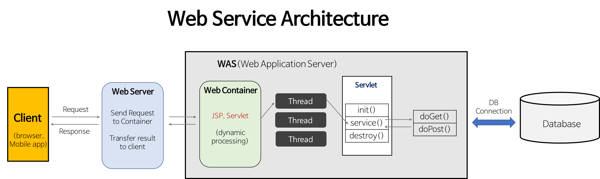
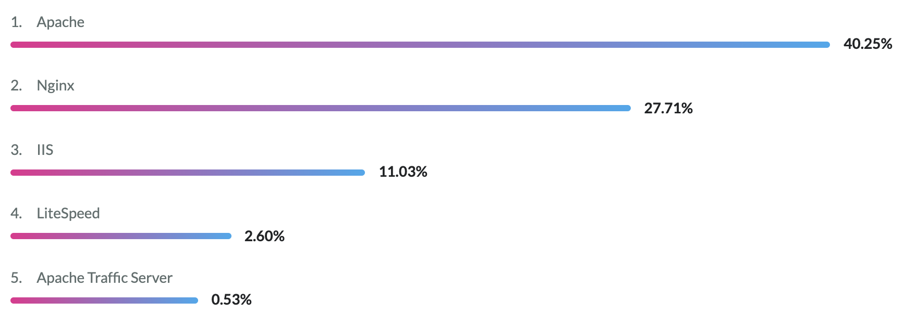
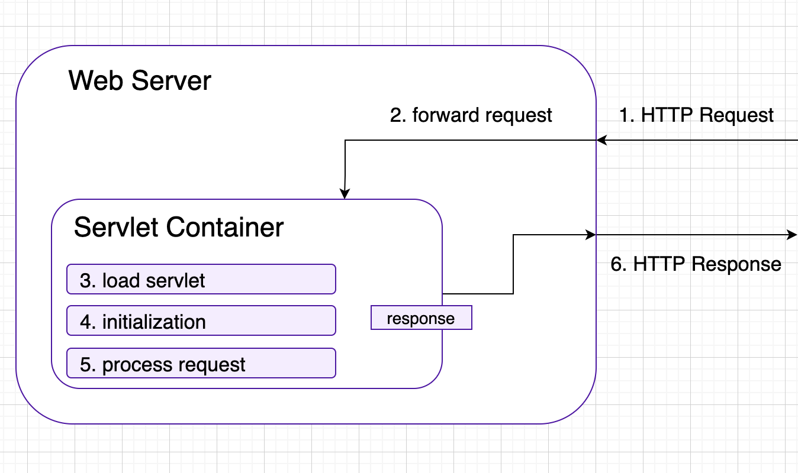
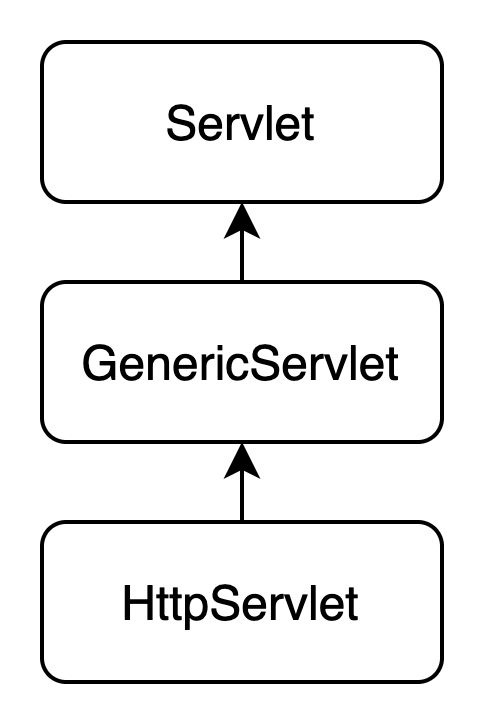

# 02. 웹 어플리케이션 아키텍처

### 컨테이너



- 웹 서버가 요청을 받으면, 컨테이너에게 요청을 넘기고,
요청을 전달받은 컨테이너는 HttpServletRequest와 HttpServletResponse 객체를 만들어서,
이를 인자로 서블릿 `doPost()`나 `doGet()` 메소드 중 하나를 호출한다
- 웹서버
    - 클라이언트로부터 HTTP 요청을 받아들이고 HTML 문서같은 웹 페이지를 반환하는 서버
    - HTTP 프로토콜을 사용한다
    - 웹 어플리케이션 서버와 같이 사용할 수 있다
    - 웹 서버는 정적인 HTML이나 이미지를 제공하는 서버이기 때문에 동적인 처리가 필요하다면 WAS를 사용해야 한다
    - 사용자가 요청한 것들 중에 웹 서버 자체적으로 처리할 수 없는 것들을 톰캣같은 컨테이너같은 곳으로 넘겨 처리 결과를 받아와서 사용자에게 넘겨주는 역할을 수행한다
    - 웹서버 종류

        2021 글로벌 웹 서버 시장 점유율

        

        - 아파치
            - 가장 대표적인 HTTP 서버
            - 1995년 이후 단 한번도 1위의 자리를 놓친적 없으나 최근 들어 Nginx에게 밀리고 있다
            - 대부분의 OS에서 사용이 가능하다
            - Apache MPM (다중처리모듈)
                - 여러 요청이 동시에 웹 서버에 접속할 때, 이 요청들을 동시에 처리할 수 있도록 해주는 아파치 웹 서버 모듈
                - 클라이언트로부터 받은 요청을 어떤 방식으로 처리할 것이냐
                - 대표적으로 prefork, worker방식이 있다
                    - prefork
                        - 미리 복수의 프로세스를 생성하여 클라이언트의 접속에 대비하는 멀티프로세스 방식
                        - 요청:프로세스 = 1:1
                        - 실행중인 프로세스를 복제하여 실행한다(메모리 영역까지 같이 복제)
                        - 프로세스 간 메모리를 공유하지 않아 안정적이다 (메모리 공간이 독립적)
                        - 메모리 등 리소스 사용량이 상대적으로 많다
                    - worker
                        - 멀티쓰레드와 멀티프로세스의 하이브리드형
                        - 요청:프로세스=n:1
                        - 요청을 스레드 단위로 처리한다
                        - 한 개의 포르세스 내의 여러 개의 스레드가 클라이언트의 요청을 처리한다
                        - 메모리 공간 전체를 복수의 스레드가 공유하므로 리소스 경합이 발생할 수 있다
                        - 메모리를 적게 사용한다
                - 대부분 prefork 방식이 기본적으로 사용되며, 사용자가 많은 경우에는 worker 방식을 사용한다
                - 아파치 기본 MPM
                    - 별도 옵션을 주지 않으면 아래가 기본이다
                    - 윈도우 OS : mpm_winnt
                    - 유닉스/리눅스 : prefork
                    - BeOS : beos
                    - Netware : mpm_netware
                    - OS/2 : mpmt_os2
            - 스레드와 프로세스 기반 구조이기 때문에 요청이 많을 수록 CPU와 메모리 사용이 증가하기 때문에 성능이 저하될 수 있다
            - 또한 아파치 서버의 프로세스가 blocking되면 요청을 처리하지 못하고, 처리가 완료될 때까지 계속 대기한다
            → keep alive를 활성화 함으로써 해결이 가능하지만, keep alive 때문에 대량 접속 시 효율이 급격하게 떨어지는 문제점이 발생한다
                - keep alive
                    - HTTP 프로토콜의 특성상 한 번 통신이 이루어지면 접속을 끊는다
                    - 하지만 keep alive on 상태에서는 keep alive timeout 시간동안 접속을 끊지 않고 다음 접속을 기다린다
                    한 번 연결된 클라이언트와 통신을 유지하고 있는 것
                    → 따라서 다음 통신 시에 커넥션을 생성하고 끊는 작업이 필요없게 된다 (성능 향상)
                    - 하지만 바쁜 서버 환경에서 keep alive를 on으로 설정해놓으면, 모든 요청마다 연결을 유지해야 하기 때문에 프로세스 수가 기하급수적으로 늘어날 수 있다
                    → 메모리를 많이 사용하게 됨
                    → 성능저하
                    ⇒ 대량 접속 시 효율이 떨어짐
            - 따라서 아파치 2.4부터는 keep alive에 대한 고민을 해결하는 새로운 MPM 방식을 지원한다
                - event (아파치 2.4~)
                    - 기존에는 클라이언트의 연결이 완전히 끝나지 않는 한 하나의 프로세스를 계속 물고 있었고 따라서 대량 접속이 발생하는 경우 효율이 굉장히 떨어지는 이슈가 있었다
                    - nginx와의 비교점이 바로 이 부분(이벤트 드리븐 지원 여부)
                    - 이벤트 드리븐 방식을 적용한 모듈
        - Nginx
            - 보안과 속도를 최적화시키고자 탄생한 웹 서버
            - 비동기 이벤트드리븐 구조
            - 고정된 프로세스만 생성하고 해당 프로세스 내부에서 비동기 방식으로 효율적으로 작업을 처리한다
            - 최소한의 리소스로 많은 수의 동시 사용자를 처리한다
            - 부하가 큰 경우에도 메모리와 cpu가 상대적으로 일관성을 유지할 수 있다
            - 대규모 웹 트래픽 처리 상황이 발생할 때 고효율을 발휘한다
            - 성능 면에서 Apache 2.2는 Nginx에 뒤쳐졌기 때문에 Nginx가 성장하게 되었음
        - IIS
            - Microsoft에서 제공하는 소프트웨어
            - 장점 : #익숙한GUI, #ASP,MSSQL같은다른Microsoft서비스와쉽게통합
            - 단점 : #비싸 #윈도우서버에서만동작 #느려
- 컨테이너
    - 컨테이너는 서블릿들의 생성/실행/파괴를 담당한다
    (서블릿이 스스로 작동하는 것이 아니라, 서블릿 컨테이너에 의해 관리된다)
    - 컨테이너는 클라이언트의 request를 받아서 response할 수 있도록, 웹 서버와 소켓을 만들어서 통신한다
    - 대표적인 예로는 톰캣이 있다
    - 톰캣은 jsp와 서블릿이 작동할 수 있는 환경을 제공한다
    - 요청을 처리하는 방법

        

        1. 웹서버가 HTTP 요청을 받는다
        2. 요청을 컨테이너로 전달한다
        3. 컨테이너는 HttpServletRequest, HttpServletResponse 객체를 생성한다
        4. 사용자가 날린 url을 분석하여 어떤 서블릿에 대한 요청인지를 알아낸다 (여기서 DD를 참조하여 알아낸다)
        5. 컨테이너에 서블릿이 없으면, 서블릿을 동적으로 로드한다
        6. 서블릿을 초기화한다 (서블릿의 init() 메소드 호출)
        서블릿이 처음 로드됐을 때 한번만 호출
        7. 서블릿의 service() 메소드를 호출한다
            - 이 과정에서 HTTP 요청이 처리된다
            - 요청 method에 따라 doGet(), doPost()를 결정한다
            - 요청을 처리한 다음 결과를 response 객체에 싣는다
        8. 다른 HTTP 요청들도 계속 처리한다
        9. 웹 서버는 response 객체를 HTTP Response로 전환한다
        10. 응답을 반환한다
    - 컨테이너의 역할
        - 웹 서버와 통신 지원
            - 서블릿과 웹 서버가 서로 통신할 수 있는 API를 제공한다
            - 따라서 웹 서버와 서블릿이 서로 통신하기 위한 통신 API에 대해서 개발자가 고민할 필요가 없다
            (웹 서버와 대화하기 위하여 개발자가 직접 ServerSocket을 만들고, 특정 포트에 리스닝하고, 연결 요청이 들어오면 스트림을 생성하는 등의 작업을 할 필요가 없다)
        - 서블릿의 라이프사이클 관리
            - 컨테이너는 서블릿의 탄생과 죽음을 관리한다
            1. 서블릿 클래스를 로딩하여 인스턴스화
            2. 초기화 메소드를 호출
            3. 요청이 들어오면 적절한 서블릿 메소드를 호출
        - 멀티스레딩 지원
            - 컨테이너는 요청이 들어올 때마다 새로운 자바 스레드를 만든다
            클라이언트의 요청에 따라 적절한 서비스 메소드를 실행하면 스레딩 작업이 끝난다
            - 서버가 다중 요청에 대한 스레드 생성 및 운영에 대해서 알아서 해준다
            - 톰캣에서는..
                - Tomcat 3.2 이전 버전에서는 각 요청이 들어올 때마다 스레드가 생성되어 각 요청을 처리했다
                - 하지만 이런 절차는 많은 부하를 야기해고, 3.2 이후부터는 ThreadPool을 사용하게 되었다
                - 톰캣의 thread pool
                    - 각 요청에 대해 스레드를 생성하여, 사용하고 난 후에도 계속해서 재사용할 수 있도록, 사용된 스레드를 'open' 상태로 계속 유지한다
                    - 이후 다른 요청이 들어면 관리되고 있던 스레드를 사용하여 해당 요청을 처리한다
                    - 요청을 처리하고 난 스레드는 관리대상이 되어 또다른 요청을 기다린다
                    - 이런 방식은 반복적인 스레드의 생성/소멸로 인한 문제를 해결한다
                    - 동시에 사용할 수 있는 스레드의 상한선, idle 상태의 스레드에 대한 최대 스레드 개수, 톰캣 기동 시 생성될 최소 스레드 수를 설정할 수 있다
        - 선언적인 보안 관리
            - 컨테이너가 있는 환경이라면, xml 배포 서술자에다가 기록하면 된다
            - 보안에 대해 뭔가 수정할 일이 생기더라도, 자바소스코드를 수정해서 컴파일 하지 않아도 된다
        - jsp 지원

- 서블릿
    - 클라이언트의 요청을 처리한다
    - 서블릿 클래스의 구현 규칙을 따른다
    - 라이프 사이클이 있다
        - `init()`
        - `service()`
        - `destroy()`
        - 톰캣에서는..
            - Servlet 객체를 생성하고 초기화하는 작업은 비용이 많은 작업이므로, 다음에 또 요청이 올 때를 대비하여 이미 생성된 Servlet 객체는 메모리에 남겨둔다
            - 톰캣이 종료되기 전이나 리로드 전에 모든 서블릿을 제거하게 된다
    - 서블릿 API

        ```java
        public interface Servlet {
            void init(ServletConfig var1) throws ServletException;
            ServletConfig getServletConfig();
            void service(ServletRequest var1, ServletResponse var2) throws ServletException, IOException;
            String getServletInfo();
            void destroy();
        }
        ```

        - `getServletConfig()`
            - 해당 서블릿의 ServletConfig를 가져온다
            - ServletConfig : 서블릿 이름, 서블릿 컨텍스트, 초기화 파라미터를 가져올 수 있다
        - `getServletInfo()`
            - 서블릿에 대한 정보를 반환한다
            - 일반적으로 서블릿 정보, 저자, 버전 등에 대한 정보를 반환한다
        - `init()`
            - 서블릿 생명 주기 중 초기화 단계
            - 클라이언트의 요청이 들어오면 컨테이너는 해당 서블릿이 메모리에 있는 지 확인한다
            없으면, init() 메소드를 호출하여 적재한다
            - 서블릿이 메모리에 로드될 때 init() 메소드가 호출된다 (단 한번만 수행된다)
            - javax.servlet.ServletConfig 인터페이스를 구현하는 오브젝트가 전달된다
            이를 통해 서블릿이 초기화 매개변수에 접근한다
        - `service()`
            - 초기화 이후에 각 요청들이 들어오면 호출된다
            - 각 요청들은 별도로 나누어진 스레드에서 처리된다
            - 요청의 종류를 판별하고 요청을 처리할 적절한 메소드로 전달한다
            - 컨테이너는 모든 요청에 대해 서블릿의 service() 메소드를 요청한다
            컨테이너에서 HttpServletRequest, HttpServletResponse를 생성하여 이 메소드를 호출한다
            - `ServletRequest`, `ServletResponse`를 매개변수로 받는다
            - `HttpServlet`의 경우 `ServletRequest`와 `ServletResponse`를 `HttpServletRequest`와 `HttpServletResponse`로 형변환한다
        - `destory()`
            - 서블릿 객체가 파괴되어야 할 때 호출된다
            - 서블릿이 가지고 있던 자원을 release 한다
            - 컨테이너가 서블릿에 종료 요청을 하면 destroy() 메소드가 호출된다
            init()과 마찬가지로 한번만 실행된다

        

        - GenericServlet : 프로토콜에 독립적으로 사용될 수 있는 서블릿 구현체
        - 웹을 위한 HTTP 서블릿을 사용하고 싶다면 HttpServlet을 사용하면 된다
    - `HttpServlet`
        - HTTP 프로토콜을 지원하는 HttpServlet
        - GenericServlet이 generic한 프로토콜을 위한 서블릿 클래스라면,
        HttpServlet은 HTTP 프로토콜을 위해 만들어진 서블릿 클래스

        메소드들

        - `getLastModified()`
            - HttpServletRequest 객체가 마지막으로 수정된 시간을 1970년 1월 1일 자정(GMT) 이후부터의 밀리초 단위로 반환한다
            - 시간을 알 수 없는 경우 음수(기본값)를 반환한다
            - 서버가 이함수를 호출하는 경우
                - 응답을 보낼 때
                    - Last-Modified header를 설정하기 위해 사용한다
                - If-Modified-since header를 포함하는 GET요청을 다룰 때
                    - 만일 getLastModified()에 의해 전달된 시간이 If-Modified-Since의 값과 일치하거나 그이전이면,
                    → “Not Modified” 상태코드(304)를 전송
                    (문서가 변경이 안되었으며, 문서의 Cache된 버전을 그대로 표시해도 충분하다)
                    - 그렇지 않은경우 doGet()을 호출하여, 서버의 출력을 전달한다.
        - `service()`

            ```java
            public void service(ServletRequest req, ServletResponse res)
            protected void service(HttpServletRequest req, HttpServletResponse resp)
            ```

            - `service(HttpServletRequest, HttpServletResponse)`는 `service(ServletRequest, ServletResponse)`의 HTTP 특정 버전
            - 표준 HTTP 요청을 수신하고 이 클래스에 정의된 doXXX 메서드로 전달한다
            - 어떤 메소드가 호출될지는 요청 객체의 method에 따라 달라진다
        - `doGet()`
            - GET 요청을 처리한다
            - GET 요청을 지원하기 위해 이 메서드를 재정의하면 HTTP HEAD 요청도 자동으로 지원된다
            (HEAD 요청은 응답에 본문을 반환하지 않고 요청 헤더 필드만 반환하는 GET 요청)
            - GET 방법은 안전해야 한다. 즉, 사용자가 책임져야 하는 부작용이 없어야 한다
            클라이언트 요청이 저장된 데이터를 변경하려는 경우 요청은 다른 HTTP 메서드를 사용해야 한다
            - 멱등해야 한다 (즉, 안전하게 반복할 수 있어야 한다)
        - `doHead()`
            - HEAD 요청을 처리한다
            - 클라이언트는 Content-Type 또는 Content-Length와 같은 응답의 헤더만 보고 싶을 때 HEAD 요청을 보낸다
            - 헤더만을 확인하여 리소스가 변경되었는지 검사할 수 있다
            - 또한 응답의 상태 코드를 통해 개체가 존재하는지 확인할 수 있다
            - 큰 용량의 리소스를 다운로드 받을지 말지 결정하기 위해서 사전 요청하는 용도로도 사용할 수 있다
            - 안전하고 멱등해야 한다
        - `doPost()`
            - POST 요청을 처리한다
            - 안전하지 않아도 되고 멱등할 필요가 없다
            - POST를 통해 요청된 작업에는 저장된 데이터를 업데이트하거나 온라인으로 아이템을 구매하는 것과 같이 사용자가 책임을 져야 하는 부작용이 있을 수 있다
        - `doPut()`
            - PUT 요청을 처리한다
            - PUT 작업은 클라이언트가 서버에 파일을 배치할 수 있도록 한다
        - `doDelete()`
            - DELETE 요청을 처리한다
            - DELETE 작업을 통해 클라이언트는 서버에서 문서나 웹 페이지를 제거할 수 있다
        - `doTrace()`
            - TRACE 요청을 처리한다
            - 주로 디버깅용으로 사용된다
            - 클라이언트에게 자신의 요청이 서버에 도달했을 때 어떻게 보이게 되는지 알려준다
        - `doOptions()`
            - OPTIONS 요청을 처리한다
            - OPTIONS 요청은 서버가 지원하는 HTTP 메서드를 결정하고 적절한 헤더를 반환한다
            - 예를 들어, 서블릿이 doGet을 재정의하는 경우 이 메서드는 다음 헤더를 반환한다 (Allow: GET, HEAD, TRACE, OPTIONS)

### MVC 패턴

비즈니스 로직과 프레젠테이션 로직을 분리한 패턴

비즈니스 로직과 프레젠테이션 로직을 분리했다는 것은, 비즈니스 로직이 프레젠테이션 로직과 별개로 존재할 수 있다는 것을 의미한다
즉, 뷰가 어떤 것이 되어도 관계가  없다는 뜻

MVC

- **M**odel
    - 비즈니스 로직. 데이터베이스와 통신하는 유일한 곳
- **V**iew
    - 프레젠테이션에 대한 책임을 갖는다
    - 도메인 모델의 상태를 변환하거나, 받아서 렌더링하는 역할을 한다
    - view를 구현할 때 주의할 점
        - 도메인 로직의 어떤 것도 알고있으면 안된다
        - 객체를 전달받아 상태를 바로 출력하는 역할만을 담당해야 한다
- **C**ontroller
    - Model과 View를 연결시켜주는 다리 역할
    - Request 객체에서 사용자가 입력한 정보를 뽑아내서,모델에 대하여 어떤 작업을 해야 하는지 알아낸다

MVC 패턴의 장점

- 사용자가 보는 페이지 처리와 데이터 처리. 그리고 이 두 가지를 중간에서 제어하는 컨트롤. 총 세 가지로 구성하면, 각각이 맡은 바에만 집중을 할 수 있게 된다
- 서로 분리되어 각자의 역할에 집중할 수 있게끔하여, 유지보수성과 어플리케이션 확장성, 유연성이 증가한다

### J2EE

- Java 2 Enterprise Edition
- 스펙들에 대한 스펙. 슈퍼스펙
- J2EE 스펙에는 컨테이너와 EJB 컨테이너로 구성되어있다
- J2EE에 완벽하게 부합되는 어플리케이션 서버는 웹 컨테이너와 EJB 컨테이너 둘 다 있어야 함
- 따라서 톰캣은 완벽한 J2EE 어플리케이션 서버가 아니다
(톰캣은 웹 컨테이너일 뿐)
- 가장 많이 사용하는 J2EE 서버
    - 웹 로직(BEA)
    - 웹스피어 (IBM)
    - JBoss AS (오픈소스)

### 3줄 요약

- 요청은 웹 서버가 받아서 동적인 처리의 경우 웹 컨테이너에게 요청을 전달하여 최종적으로 서블릿에서 요청을 처리한다
- 컨테이너는 웹서버와 서블릿의 통신을 지원하며, 서블릿은 컨테이너에 의해 관리된다
- MVC 패턴을 통해 역할을 분리하여 확장성/유연성을 향상시킨다

### Reference

[https://velog.io/@muchogusto/웹서버란-무엇인가](https://velog.io/@muchogusto/%EC%9B%B9%EC%84%9C%EB%B2%84%EB%9E%80-%EB%AC%B4%EC%97%87%EC%9D%B8%EA%B0%80)

[https://s-jg.tistory.com/27](https://s-jg.tistory.com/27)

[https://m.blog.naver.com/PostView.naver?isHttpsRedirect=true&blogId=kkson50&logNo=221099080215](https://m.blog.naver.com/PostView.naver?isHttpsRedirect=true&blogId=kkson50&logNo=221099080215)

[http://www.opennaru.com/jboss/apache-prefork-vs-worker/](http://www.opennaru.com/jboss/apache-prefork-vs-worker/)

[https://victorydntmd.tistory.com/231](https://victorydntmd.tistory.com/231)

[https://hackr.io/blog/nginx-vs-apache](https://hackr.io/blog/nginx-vs-apache)