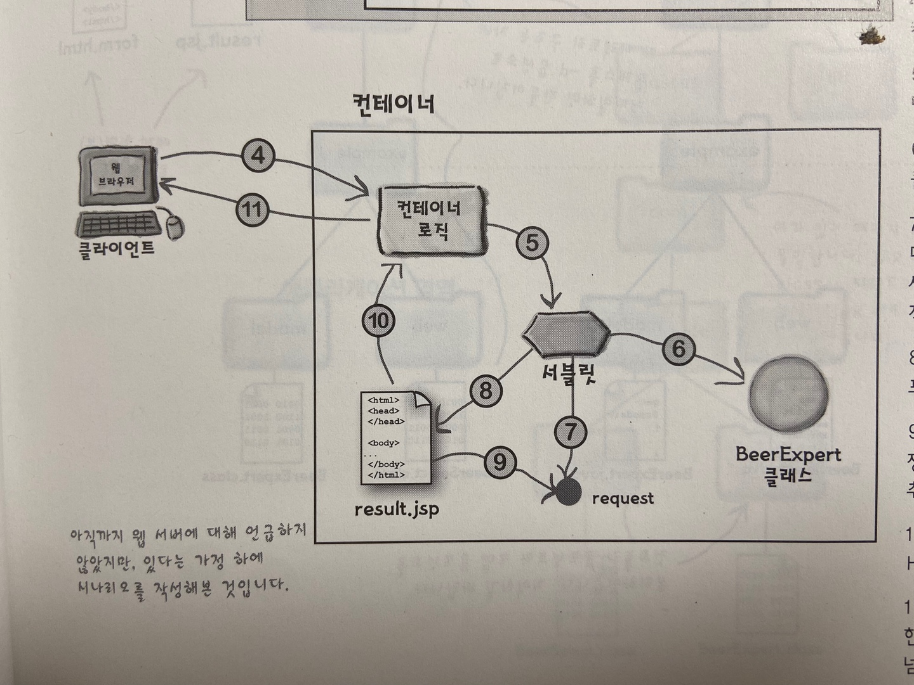
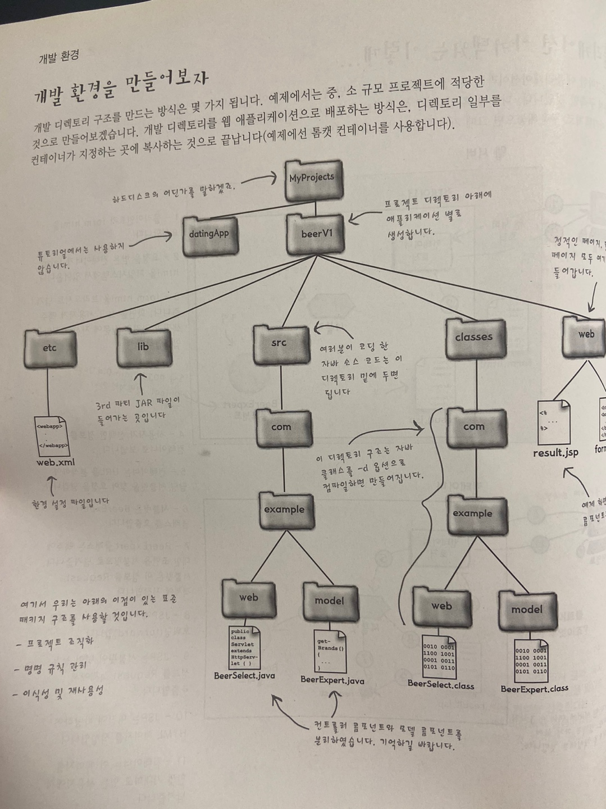
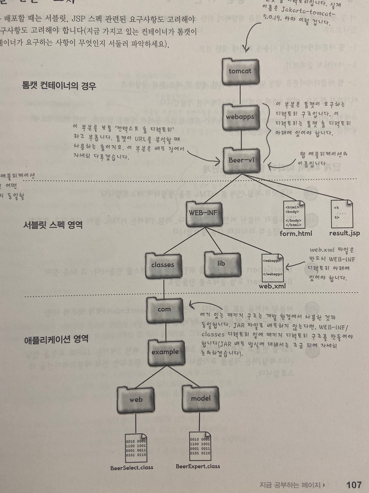
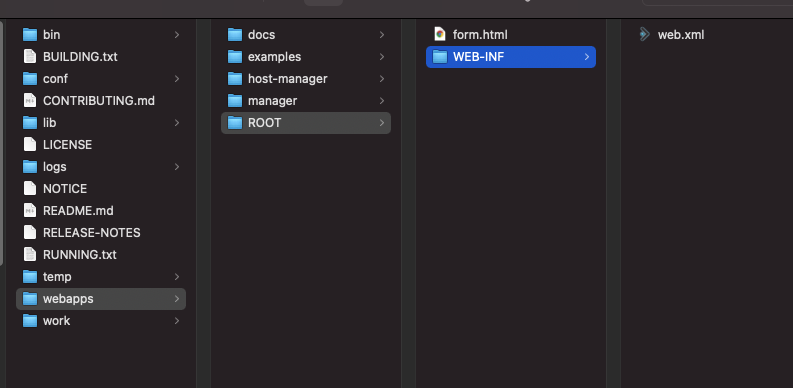
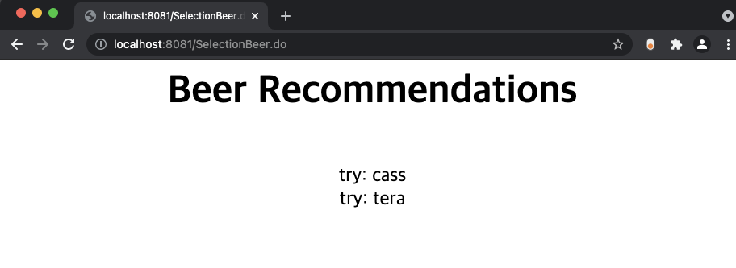

# #3 초간단 미니 MVC 튜토리얼

- 초간단 미니 mvc 튜토리얼 flow



1. 사용자가 선택한 정보를 컨테이너로 보냄
2. 컨테이너는 url을 분석하여 담당 서블릿을 찾아 요청을 넘김
3. 서블릿은 BeerExpert 클래스를 호출함
4. BeerExpert 클래스는 맥주에 대한 조언을 서블릿으로 넘겨줌, 서블릿은 이 정보를 Request객체에 저장함
5. JSP에 이 Request 객체를 포워딩 함
6. JSP는 서블릿이 넣어 놓은 정보를 Request객체에서 추출함
7. JSP는 여기에 바탕하여 HTML 페이지를 작성함
8. 컨테이너는 이 페이지를 사용자에게 넘겨줌 


- 개발환경 만들기




- 배포환경 만들기



## 초간단 MVC ver.1

```html
<html><body>
<h1 align="center">Beer Selection Page</h1>
	<center>
		<form method="POST" action="/SelectionBeer.do">
			<select name="color" size="1">
				<option value="light"> light </option>
				<option value="blue"> blue </option>
				<option value="red"> red </option>
			</select>
			<input type="submit"/>
    </form>
	</center>
</body>
</html>

```

- form method에 POST

  - POST 요청은 html from을 통해 서버에 전송하고 서버에 변경사항을 만듦.

  - 요청 본문의 유형은 Content-Type 헤더로 결정됨

    - 대부분의 언어에서는 default값이 `text/html` 임
    - 여러 Content-Type들 [https://www.freeformatter.com/mime-types-list.html](https://www.freeformatter.com/mime-types-list.html)

    | 요청에 본문 존재                                             | 예                             |
    | :----------------------------------------------------------- | ------------------------------ |
    | 성공 응답에 본문 존재                                        | 예                             |
    | [안전함](https://developer.mozilla.org/ko/docs/Glossary/Safe) | 아니오                         |
    | [멱등성](https://developer.mozilla.org/ko/docs/Glossary/Idempotent) | 아니오                         |
    | [캐시 가능 (en-US)](https://developer.mozilla.org/en-US/docs/Glossary/cacheable) | freshness(신선도) 정보 포함 시 |
    | HTML form에서 사용 가능                                      | 예                             |

  - 안전함은 맥락에 따라 여러 의미를 가질 수 있지만 HTTP 메서드가 서버의 상태를 바꾸지 않으면 그 메서드가 안전하다고 말함. ex GET, HEAD, OPTIONS

  - 멱등성은 요청을 한 번 보내는 것과 여러번 연속으로 보내는 것이 같은 효과를 지니고 서버의 상태도 동일하게 남을 때 멱등성이 있다고함. GET, HEAD, PUT, DELETE 메서드는 멱등성을 가지지만 POST는 멱등성을 갖지 않음

  - 기타 HTTP 요청 메서드에 대한 내용 [https://developer.mozilla.org/ko/docs/Web/HTTP/Methods](https://developer.mozilla.org/ko/docs/Web/HTTP/Methods)

- form action에 SelectionBeer.do

  - SelectionBeer.do는 실제 파일명이 아닌 논리적인 이름
  - 작동하는 방식을 알기 위해서는 web.xml(배포 서술자)를 확인하면 됨
  - 클라이언트가 요청한 SelectionBeer.do는 컨테이너가 사용하는 실제 서블릿 클래스 파일에 매핑되어 있음
  - .do는 논리적인 이름의 일부이고 실제 파일의 확장자나 타입이 아님


- web.xml

```xml
<?xml version="1.0" encoding="UTF-8"?>

<web-app xmlns="https://jakarta.ee/xml/ns/jakartaee"
  xmlns:xsi="http://www.w3.org/2001/XMLSchema-instance"
  xsi:schemaLocation="https://jakarta.ee/xml/ns/jakartaee
                      https://jakarta.ee/xml/ns/jakartaee/web-app_5_0.xsd"
  version="5.0"
  metadata-complete="true">

  <servlet>
    <!-- 서블릿 이름 -->
    <servlet-name>Ch3 Beer</servlet-name>
    <!-- 실제 서블릿 매핑 클래스 -->
    <servlet-class>com.example.web.BeerSelect</servlet-class> 
  </servlet>

  <servlet-mapping>
    <servlet-name>Ch3 Beer</servlet-name>
    <!-- 실제 매핑될 서블릿 url -->
    <url-pattern>/SelectionBeer.do</url-pattern>
  </servlet-mapping>

</web-app>

```

- tomcat 디렉토리 모습




- 사이트 모습


**'제출'버튼 을 클릭했을때의 과정**

- `action="/SelectionBeer.do"` 에서 `/` 는 context root를 의미함
- submit을 하면 컨테이너는 xml의 `<servlet-mapping>` 항목에서 `/SelectionBeer.do` 이라는 값을 가진 `<url-pattern>`을 찾음
- 일치하는 `<servlet-mapping>`이 있다면 `<servlet-name>` 을 통해 `<servlet-class>` 를 찾음. 이 값이 바로 요청을 처리할 서블릿 클래스
- 이 과정에서 서블릿이 초기화된 적이 없다면 컨테이너는 클래스를 로드하고 초기화함

> 서블릿이 한번 초기화되고 이후에 변경되지 않는 이상 해당 객체를 재활용함

- 컨테이너는 요청을 처리할 새로운 스레드를 시작하고 서블릿의 service() 메서드에 Request 객체 참조를 인자로 넘김
- 스레드가 완료되면 클라이언트에게 응답을 보냄.

**서블릿 코드**

```java
package com.example.web;

import javax.servlet.ServletException;
import javax.servlet.http.HttpServlet;
import javax.servlet.http.HttpServletRequest;
import javax.servlet.http.HttpServletResponse;
import java.io.IOException;
import java.io.PrintWriter;

public class BeerSelect extends HttpServlet {

    private static final long serialVersionUID = -3027477011419869612L;

    @Override
    protected void doPost(HttpServletRequest req, HttpServletResponse resp) throws ServletException, IOException {
        resp.setContentType("text/html");
        PrintWriter out = resp.getWriter();
        out.println("Beer Selection Advice<br>");
        String c = req.getParameter("color");
        out.println("<br>Got beer color " + c);
    }
}

```


- `Servlet`(interface) <- `GenericServlet` <- `HttpServlet`
- `Servlet`의 메서드들

  - `void init(ServletConfig config) throws ServletException`
    - 서블릿이 서비스에 배치되고 있음을 서블릿에 나타내기 위해 서블릿 컨테이너에 의해 호출됨
    - 서블릿 컨테이너는 서블릿을 인스턴스화한 후 정확히 한 번 init 메서드를 호출함
    - 서블릿이 요청을 수신하려면 init() 메서드가 성공적으로 완료되어야함
  - `ServletConfig getServletConfig()`
    - 초기화에 사용된 `ServletConfig` 객체를 반환함
    - `GenericServlet` 클래스에서 구현했음
  - ` void service(ServletRequest req, ServletResponse res) throws ServletException, IOException`
    - 서블릿이 요청에 응답할 수 있도록 서블릿 컨테이너에 의해 호출됨
    - 응답의 상태 코드는 오류를 던지거나 보내는 서블릿에 대해 항상 설정되어야 함
    - 서블릿은 일반적으로 여러 요청을 동시에 처리할 수 있는 다중 스레드 서블릿 컨테이너 내에서 실행됨
    - 개발자는 파일, 네트워크 연결, 서블릿의 클래스 및 인스턴스 변수와 같은 공유 리소스에 대한 액세스를 동기화해야 한다는 사실을 알고 있어야함
  - `String getServletInfo()`
    - 작성자, 버전 및 저작권과 같은 서블릿에 대한 정보를 반환함
    - 이 메서드가 반환하는 문자열은 html, xml 등의 마크업이 아닌 일반 텍스트여야함
  - `void destroy()`
    - 서블릿이 서비스에서 제외되고 있음을 서블릿에 나타내기 위해 서블릿 컨테이너에 의해 호출됨.
    - 이 메서드는 서블릿의 서비스 메서드 내의 모든 스레드가 종료되거나 시간 초과 기간이 경과한 후에만 호출됨
    - 서블릿 컨테이너가 이 메서드를 호출한 후에는 이 서블릿에서 서비스 메서드를 다시 호출하지 않음
    - 이 방법은 서블릿이 보유하고 있는 리소스를 정리할 기회를 제공하고 모든 영구 상태가 메모리에서 서블릿의 현재 상태와 동기화되도록 함
- [https://docs.oracle.com/javaee/7/api/javax/servlet/Servlet.html%20void%20init(ServletConfig%20config)%20throws%20ServletException%20getServletConfig](https://docs.oracle.com/javaee/7/api/javax/servlet/Servlet.html%20void%20init(ServletConfig%20config)%20throws%20ServletException%20getServletConfig)

> HttpServlet.java의 service() 구현
>
> ```java
> protected void service(HttpServletRequest req, HttpServletResponse resp)
>      throws ServletException, IOException
>  {
>      String method = req.getMethod();
> 
>      if (method.equals(METHOD_GET)) {
>          long lastModified = getLastModified(req);
>          if (lastModified == -1) {
>              // servlet doesn't support if-modified-since, no reason
>              // to go through further expensive logic
>              doGet(req, resp);
>          } else {
>              long ifModifiedSince = req.getDateHeader(HEADER_IFMODSINCE);
>              if (ifModifiedSince < lastModified) {
>                  // If the servlet mod time is later, call doGet()
>                  // Round down to the nearest second for a proper compare
>                  // A ifModifiedSince of -1 will always be less
>                  maybeSetLastModified(resp, lastModified);
>                  doGet(req, resp);
>              } else {
>                  resp.setStatus(HttpServletResponse.SC_NOT_MODIFIED);
>              }
>          }
> 
>      } else if (method.equals(METHOD_HEAD)) {
>          long lastModified = getLastModified(req);
>          maybeSetLastModified(resp, lastModified);
>          doHead(req, resp);
> 
>      } else if (method.equals(METHOD_POST)) {
>          doPost(req, resp);
> 
>      } else if (method.equals(METHOD_PUT)) {
>          doPut(req, resp);
> 
>      } else if (method.equals(METHOD_DELETE)) {
>          doDelete(req, resp);
> 
>      } else if (method.equals(METHOD_OPTIONS)) {
>          doOptions(req,resp);
> 
>      } else if (method.equals(METHOD_TRACE)) {
>          doTrace(req,resp);
> 
>      } else {
>          //
>          // Note that this means NO servlet supports whatever
>          // method was requested, anywhere on this server.
>          //
> 
>          String errMsg = lStrings.getString("http.method_not_implemented");
>          Object[] errArgs = new Object[1];
>          errArgs[0] = method;
>          errMsg = MessageFormat.format(errMsg, errArgs);
> 
>          resp.sendError(HttpServletResponse.SC_NOT_IMPLEMENTED, errMsg);
>      }
>  }
> ```

- `ServletRequest`(interface) <- `HttpServletRequest`(interface) <- `RequestFacade`(default boot 2.5.4) [docs](https://tomcat.apache.org/tomcat-8.0-doc/api/org/apache/catalina/connector/RequestFacade.html)
  - 서블릿에 클라이언트 요청 정보를 제공하는 개체를 정의함
  - 서블릿 컨테이너는 `ServletRequest` 객체를 생성하고 이를 서블릿의 서비스 메서드에 인수로 전달함
  - `ServletRequest` 객체는 매개변수 이름과 값, 속성 등을 포함한 데이터를 제공함
  - `ServletRequest` 를 확장하는 인터페이스는 추가 프로토콜별 데이터를 제공할 수 있음 ex Http -> `HttpServletRequest`
  - [https://docs.oracle.com/javaee/7/api/javax/servlet/ServletRequest.html](https://docs.oracle.com/javaee/7/api/javax/servlet/ServletRequest.html)
- `ServletResponse`(interface) <- `HttpServletResponse`(interface) <- `ResponseFacade` (default boot 2.5.4) [docs](https://tomcat.apache.org/tomcat-8.0-doc/api/org/apache/catalina/connector/ResponseFacade.html)
  - 클라이언트에 응답을 보낼 때 서블릿을 지원하는 개체를 정의함
  - 서블릿 컨테이너는 `ServletResponse` 객체를 생성하고 이를 서블릿의 서비스 메서드에 인수로 전달함
  - 문자는 `getWriter()`, binary는 `getOutPutStream()` 사용
  - [https://docs.oracle.com/javaee/7/api/javax/servlet/ServletResponse.html](https://docs.oracle.com/javaee/7/api/javax/servlet/ServletResponse.html)


## 초간단 MVC ver.2

```java
package com.example.model;

import java.util.ArrayList;
import java.util.List;

public class BeerExpect {
    public List<String> getBrands(String color) {
        ArrayList<String> brands = new ArrayList<>();

        if(color.equals("red")) {
            brands.add("red rock");
        } else if (color.equals("blue")) {
            brands.add("blue moon");
        } else {
            brands.add("cass");
            brands.add("tera");
        }

        return brands;
    }
}

```


```java
package com.example.web;

import com.example.model.BeerExpect;

import javax.servlet.ServletException;
import javax.servlet.annotation.WebServlet;
import javax.servlet.http.HttpServlet;
import javax.servlet.http.HttpServletRequest;
import javax.servlet.http.HttpServletResponse;
import java.io.IOException;
import java.io.PrintWriter;
import java.util.List;

public class BeerSelect extends HttpServlet {

    private static final long serialVersionUID = -3027477011419869612L;

    @Override
    protected void doPost(HttpServletRequest req, HttpServletResponse resp) throws ServletException, IOException {

        String c = req.getParameter("color");
        BeerExpect be = new BeerExpect();
        List<String> brands = be.getBrands(c);

        resp.setContentType("text/html");
        PrintWriter out = resp.getWriter();
        out.println("Beer Selection Advice<br>");

        for (String brand : brands) {
            out.println("<br>try: " + brand);
        }
    }
}
```

- 작업 흐름
  - 브라우저가 컨테이너에게 요청을 보냄
  - 컨테이너는 url이 올바른 서블릿을 호출할 것인지를 판단한 다음, 요청을 서블릿으로 넘김
  - 서블릿은 `BeerExpert`에게 도움을 요청
  - 서블릿이 `Response` 객체에 쓰기 작업을 함
  - 컨테이너는 페이지를 클라이언트로 보냄





## 초간단 MVC ver.3

```java
package com.example.web;

import com.example.model.BeerExpect;

import javax.servlet.RequestDispatcher;
import javax.servlet.ServletException;
import javax.servlet.annotation.WebServlet;
import javax.servlet.http.HttpServlet;
import javax.servlet.http.HttpServletRequest;
import javax.servlet.http.HttpServletResponse;
import java.io.IOException;
import java.io.PrintWriter;
import java.util.List;

public class BeerSelect extends HttpServlet {

    private static final long serialVersionUID = -3027477011419869612L;

    @Override
    protected void doPost(HttpServletRequest req, HttpServletResponse resp) throws ServletException, IOException {

        String c = req.getParameter("color");
        BeerExpect be = new BeerExpect();
        List<String> brands = be.getBrands(c);

        resp.setContentType("text/html");
        PrintWriter out = resp.getWriter();
        out.println("Beer Selection Advice<br>");

//        for (String brand : brands) {
//            out.println("<br>try: " + brand);
//        }

        req.setAttribute("brands", brands); //brands 라는 이름으로 brands객체 넣기

        RequestDispatcher view = req.getRequestDispatcher("result.jsp");
        view.forward(req, resp); //result.jsp라는 이름의 view로 포워딩
    }
}
```


```java
<%@ page import="java.util.List" %>

<html>
<body>
<h1 align="center">Beer Recommendations</h1>

<p>
    <%
        List<String> brands = (List<String>) request.getAttribute("brands");
        for (String brand : brands) {
            out.println("<br>try: " + brand);
        }
    %>
</p>
</body>
</html>

```


