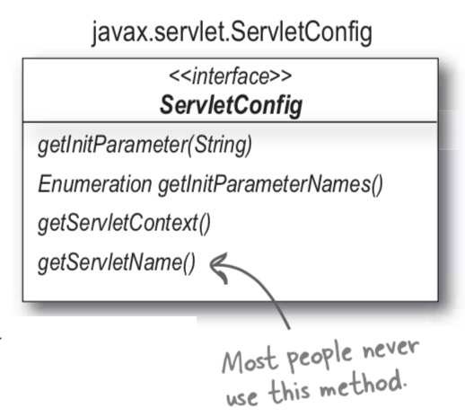

# Chapter 5. 웹 애플리케이션이 되어 보자: 속성과 리스너

- 웹 애플리케이션은 서비스를 제공하기 위하여 많은 컴포넌트들이 함께 협업한다.
    - 모델
    - 컨트롤러
    - 뷰
    - 파라미터
    - 속성
    - 도우미(Helper)클래스
- 이러한 컴포넌트들을 어떻게 서로 묶어줄까? 아래와 같은 질문을 할 수 있다.
    - 만약 공유해야 할 정보가 있다면 어떻게 해야?
    - 정보를 숨겨야 한다면?
    - 스레드 안전을 보장하려면?
- 이걸 어떻게 하느냐가 개발 속도나 개발 효율성에 있어서 큰 역할을 한다.


## 1. ServletConfig




### 1-1. 초기화 파라미터

---

- 하드코딩: 보안과 유지보수 측면에서 불리하다.
    - 만약 서블릿 클래스나 HTML 에 나의 이메일을 출력해야 한다면 쓸 수 있는 방법 중 하나
- 서블릿에서는 이를 DD(`web.xml`)안에 넣어서 해결한다.
    
    
    
- DD 의 `<servlet>`항목 안에 `<param-name>`과 `<param-value>`로 작성한다.
    
    → 사용은 `getInitParameter()`로!
    
- 모든 서블릿에는 상속받은 `getServletConfig()`가 있다.

### 1-2. 서블릿 초기화가 된 다음에야 서블릿 초기화 파라미터를 사용할 수 있습니다.

---

- 서블릿에는 상속받은 `getServletConfig()`메서드가 있다.
    - 이 참조로 `ServletConfig`의 메서드(ex> `getInitParameter()`)를 호출할 수 있게 된다.
- 서블릿 생성자에서는 `ServletConfig`의 메서드를 호출할 수 없다.
    
    
    
    - 서블릿의 일생을 잘 훑어보면 너무 일찍 호출했기 때문
    - 컨테이너가 서블릿의 `init()`을 호출하고 난 다음에야, 서블릿은 서블릿의 정체성을 갖는다.
- `ServletConfig`객체가 인스턴스화되는 시점
    - 컨테이너가 서블릿 클래스 인스턴스를 만들기 전에, DD에서 서블릿 초기화 파라미터를 읽어`ServletConfig` 인스턴스를 만든다.
    - 컨테이너가 서블릿의 `init()`메서드를 호출하기 전, 서블릿 클래스 인스턴스를 만들기 전!
        
        
        
        - 컨테이너가 서블릿을 초기화할 때, 서블릿마다 하나씩 `ServletConfig`를 생성한다.

- `init()`은 재정의가 가능하다. `init(ServletConfig)`은 무엇인가?
    - 슈퍼 클래스 `GenericServlet`에는 두 개의 init 메서드가 있다.
    - `init(ServletConfig)`: 내부에서 `init()`메서드를 호출한다.
        
        
        
        - 컨테이너가 자동으로 `init(ServletConfig)`를 실행하면 그 내부에서 개발자가 재정의한 `init()`도 실행하게 된다.

### 1-3. 컨테이너가 서블릿을 초기화할 때 단 한번만 서블릿 초기화 파리미터를 읽습니다.

---

- 컨테이너는 DD 초기화 파라미터를 두 번 다시 읽지 않는다.
    - 이름/값의 쌍이 `ServletConfig`안에 기록이 되면, 서블릿이 다시 배포되지 않는 한 DD 를 수정한다고 바뀌지 않는다.
    - 하지만 여러 툴로 인해 톰캣을 내리지 않고 하는 방법이 존재하기는 하다.

1. 컨테이너는 배포 서술자(DD)를 읽는다. 물론 초기화 파라미터(`<init-param>`)도 읽는다.
2. 컨테이너는 새로운 `ServletConfig`인스턴스를 만든다. (서블릿당 하나씩)
3. 컨테이너는 초기화 파라미터에 있는 값들을 이름/값의 쌍의 형식으로 읽어들인다.
4. 컨테이너는 `ServletConfig`객체에 이름/값으로 된 초기화 파라미터를 설정한다.
5. 컨테이너는 서블릿 클래스 인스턴스를 생성한다.
6. 컨테이너는 서블릿의 `init(ServletConfig)`를 호출한다.

### 1-4. ServletConfig 테스트하기

---

- `ServletConfig`의 역할
    - 초기화 파라미터(DD 에서 서블릿에 설정한 값)에 접근할 수 있는 능력이 있다.
        
        
        
    - 컨텍스트 정보(서블릿 설정 정보)를 쥐고 있는 `ServletContext`를 리턴하는 메서드를 제공한다.

- JSP 에서는 서블릿 초기화 파라미터(`ServletConfig`)에 어떻게 접근하는가?
    - 서블릿 설정을 다른 컴포넌트와 공유하기 위해, `Request`객체를 사용하는 방법이 있을 수 있다.
        
        
        

## 2. ServletContext

- ServletContext: 특정 서블릿에만 적용되는 초기화 파라미터말고, 웹 애플리케이션 전체(모든 컴포넌트)에서 공유하는 객체


### 2-1. Context 란?

---

- 사용자와 다른 사용자, 사용자와 시스템 또는 디바이스간의 상호작용에 영향을 미치는 사람, 장소, 개체등의 현재 상황(상태)를 규정하는 정보들을 말한다.

- OS 의 Context: CPU 가 프로세스를 실행하기 위한 해당 프로세스의 정보들. PCB 에 저장된다.
    - 프로세스 상태 : 생성, 준비, 수행, 대기, 중지
    - 프로그램 카운터 : 프로세스가 다음에 실행할 명령어 주소
    - 레지스터
    - 프로세스 번호
- Context Switching
    - 멀티프로세스 환경에서 CPU 가 어떤 하나의 프로세스를 실행하고 있는 상태에서 인터럽트 요청에 의해 다음 우선 순위의 프로세스가 실행되어야 할 때
    - 기존 프로세스의 상태 또는 레지스터 값(Context)을 저장하고, CPU가 다음 프로세스를 수행하도록 새로운 프로세스의 상태 또는 레지스터 값(Context)를 교체하는 작업

### 2-2. 웹 애플리케이션의 Context

---

- 컨텍스트(Context) 초기화 파라미터의 작동 방식은 서블릿 초기화 파라미터와 동일하다.
- 그러나 컨텍스트(Context)초기화 파라미터는 특정 하나의 서블릿만 사용하는 것이 아니라 모든 웹 애플리케이션에서 이용할 수 있다는 차이가 있다.
- 웹 애플리케이션에 있는 모든 JSP, 서블릿에서 별다른 코딩 없이도 컨텍스트 초기화 파라미터 정보에 접근할 수 있다.
    
    
    

- 책의 코드를 봐보자 - 컨텍스트 초기화 파라미터가 답이다 (p.191)
    
    
    
    - `<context-param>`은 `<servlet>`밖에 위치한다 → 전체 애플리케이션을 위한 항목이기 때문
    - 컨텍스트 객체의 정보를 가져오기 위해서는 `getServletcontext()`를 이용해 Context 의 참조 값을 가져온다.
    - 컨텍스트 초기화 파라미터는 컨테이너 실행시 생성되고 컨테이너 종료 시 소멸된다.

### 2-3. ServletContext 와 ServletConfig 의 차이

---

- DD (web.xml)
    
    
    
- 서블릿 초기화 파라미터: `ServletConfig`
    - 범위: `<init-param>`항목을 포함하고 있는 서블릿안에서만
    - 서블릿 코드 안에서 이 값을 속성(Attribute)에 저장하여 다른 컴포넌트에서도 이용 가능하게 만들 수 있다.
- 컨텍스트 초기화 파라미터: `ServletContext`
    - 범위: 웹 애플리케이션에 존재하는 어떤 서블릿이나 JSP 모두 접근 가능

### 2-4. ServletConfig 는 서블릿 당 하나 ServletContext 는 웹 애플리케이션 당 하나

---

- 웹 애플리케이션은 오직 하나의 `ServletContext`로 전체 웹 애플리케이션에서 정보를 공유한다.
- 그러나, 웹 애플리케이션 안에 있는 서블릿은 자신만의 `ServletConfig`를 가진다.
    
    
    
- 애플리케이션이 배포 실행되고 있다면, `ServletContext`는 JVM 당 하나이다.

- `ServletContext` 초기화
    1. 컨테이너는 DD 에 있는 `<context-param>`항목을 읽고 각각의 이름/값의 쌍을 만든다.
    2. 컨테이너는 `ServletContext`객체를 하나 생성한다.
    3. 컨테이너는 생성한 `ServletContext`객체의 참조값을 context init parameters 로 넘긴다.
    4. 현재 웹 애플리케이션에 있는 모든 서블릿과 JSP는 바로 이 `ServletContext`에 접근 할 수 있다.

- `ApplicationContext`
    
    ```java
    package org.apache.catalina.core;
    
    public class ApplicationContext implements ServletContext {
        /**
         * The merged context initialization parameters for this Context.
         */
        private final Map<String,String> parameters = new ConcurrentHashMap<>();
    
        public ApplicationContext(StandardContext context) {
            super();
            this.context = context;
            this.service = ((Engine) context.getParent().getParent()).getService();
            this.sessionCookieConfig = new ApplicationSessionCookieConfig(context);
    
            // Populate session tracking modes
            populateSessionTrackingModes();
        }
        ...
        @Override
        public ServletRegistration.Dynamic addServlet(String servletName, String className) {
            return addServlet(servletName, className, null, null);
        }
        
        private ServletRegistration.Dynamic addServlet(String servletName, String servletClass,
                    Servlet servlet, Map<String,String> initParams) throws IllegalStateException {
        ...
        }
    }
    ```
    
- `StandardContext`
    
    ```java
    package org.apache.catalina.core;
    
    public class StandardContext extends ContainerBase
            implements Context, NotificationEmitter {
    
        /**
         * Start this component and implement the requirements
         * of {@link org.apache.catalina.util.LifecycleBase#startInternal()}.
         *
         * @exception LifecycleException if this component detects a fatal error
         *  that prevents this component from being used
         */
        @Override
        protected synchronized void startInternal() throws LifecycleException {
    
            if(log.isDebugEnabled())
                log.debug("Starting " + getBaseName());
    
            // Send j2ee.state.starting notification
            if (this.getObjectName() != null) {
                Notification notification = new Notification("j2ee.state.starting",
                        this.getObjectName(), sequenceNumber.getAndIncrement());
                broadcaster.sendNotification(notification);
            }
    
            setConfigured(false);
            boolean ok = true;
    
            // Currently this is effectively a NO-OP but needs to be called to
            // ensure the NamingResources follows the correct lifecycle
            if (namingResources != null) {
                namingResources.start();
            }
    
            // Post work directory
            postWorkDirectory();
    
            // Add missing components as necessary
            if (getResources() == null) {   // (1) Required by Loader
                if (log.isDebugEnabled())
                    log.debug("Configuring default Resources");
    
                try {
                    setResources(new StandardRoot(this));
                } catch (IllegalArgumentException e) {
                    log.error(sm.getString("standardContext.resourcesInit"), e);
                    ok = false;
                }
            }
            if (ok) {
                resourcesStart();
            }
    
            if (getLoader() == null) {
                WebappLoader webappLoader = new WebappLoader();
                webappLoader.setDelegate(getDelegate());
                setLoader(webappLoader);
            }
    
            // An explicit cookie processor hasn't been specified; use the default
            if (cookieProcessor == null) {
                cookieProcessor = new Rfc6265CookieProcessor();
            }
    
            // Initialize character set mapper
            getCharsetMapper();
    
            // Validate required extensions
            boolean dependencyCheck = true;
            try {
                dependencyCheck = ExtensionValidator.validateApplication
                    (getResources(), this);
            } catch (IOException ioe) {
                log.error(sm.getString("standardContext.extensionValidationError"), ioe);
                dependencyCheck = false;
            }
    
            if (!dependencyCheck) {
                // do not make application available if dependency check fails
                ok = false;
            }
    
            // Reading the "catalina.useNaming" environment variable
            String useNamingProperty = System.getProperty("catalina.useNaming");
            if ((useNamingProperty != null)
                && (useNamingProperty.equals("false"))) {
                useNaming = false;
            }
    
            if (ok && isUseNaming()) {
                if (getNamingContextListener() == null) {
                    NamingContextListener ncl = new NamingContextListener();
                    ncl.setName(getNamingContextName());
                    ncl.setExceptionOnFailedWrite(getJndiExceptionOnFailedWrite());
                    addLifecycleListener(ncl);
                    setNamingContextListener(ncl);
                }
            }
    
            // Standard container startup
            if (log.isDebugEnabled())
                log.debug("Processing standard container startup");
    
            // Binding thread
            ClassLoader oldCCL = bindThread();
    
            try {
                if (ok) {
                    // Start our subordinate components, if any
                    Loader loader = getLoader();
                    if (loader instanceof Lifecycle) {
                        ((Lifecycle) loader).start();
                    }
    
                    // since the loader just started, the webapp classloader is now
                    // created.
                    if (loader.getClassLoader() instanceof WebappClassLoaderBase) {
                        WebappClassLoaderBase cl = (WebappClassLoaderBase) loader.getClassLoader();
                        cl.setClearReferencesRmiTargets(getClearReferencesRmiTargets());
                        cl.setClearReferencesStopThreads(getClearReferencesStopThreads());
                        cl.setClearReferencesStopTimerThreads(getClearReferencesStopTimerThreads());
                        cl.setClearReferencesHttpClientKeepAliveThread(getClearReferencesHttpClientKeepAliveThread());
                        cl.setClearReferencesObjectStreamClassCaches(getClearReferencesObjectStreamClassCaches());
                        cl.setClearReferencesThreadLocals(getClearReferencesThreadLocals());
                    }
    
                    // By calling unbindThread and bindThread in a row, we setup the
                    // current Thread CCL to be the webapp classloader
                    unbindThread(oldCCL);
                    oldCCL = bindThread();
    
                    // Initialize logger again. Other components might have used it
                    // too early, so it should be reset.
                    logger = null;
                    getLogger();
    
                    Realm realm = getRealmInternal();
                    if(null != realm) {
                        if (realm instanceof Lifecycle) {
                            ((Lifecycle) realm).start();
                        }
    
                        // Place the CredentialHandler into the ServletContext so
                        // applications can have access to it. Wrap it in a "safe"
                        // handler so application's can't modify it.
                        CredentialHandler safeHandler = new CredentialHandler() {
                            @Override
                            public boolean matches(String inputCredentials, String storedCredentials) {
                                return getRealmInternal().getCredentialHandler().matches(inputCredentials, storedCredentials);
                            }
    
                            @Override
                            public String mutate(String inputCredentials) {
                                return getRealmInternal().getCredentialHandler().mutate(inputCredentials);
                            }
                        };
                        context.setAttribute(Globals.CREDENTIAL_HANDLER, safeHandler);
                    }
    
                    // Notify our interested LifecycleListeners
                    fireLifecycleEvent(Lifecycle.CONFIGURE_START_EVENT, null);
    
                    // Start our child containers, if not already started
                    for (Container child : findChildren()) {
                        if (!child.getState().isAvailable()) {
                            child.start();
                        }
                    }
    
                    // Start the Valves in our pipeline (including the basic),
                    // if any
                    if (pipeline instanceof Lifecycle) {
                        ((Lifecycle) pipeline).start();
                    }
    
                    // Acquire clustered manager
                    Manager contextManager = null;
                    Manager manager = getManager();
                    if (manager == null) {
                        if (log.isDebugEnabled()) {
                            log.debug(sm.getString("standardContext.cluster.noManager",
                                    Boolean.valueOf((getCluster() != null)),
                                    Boolean.valueOf(distributable)));
                        }
                        if ((getCluster() != null) && distributable) {
                            try {
                                contextManager = getCluster().createManager(getName());
                            } catch (Exception ex) {
                                log.error(sm.getString("standardContext.cluster.managerError"), ex);
                                ok = false;
                            }
                        } else {
                            contextManager = new StandardManager();
                        }
                    }
    
                    // Configure default manager if none was specified
                    if (contextManager != null) {
                        if (log.isDebugEnabled()) {
                            log.debug(sm.getString("standardContext.manager",
                                    contextManager.getClass().getName()));
                        }
                        setManager(contextManager);
                    }
    
                    if (manager!=null && (getCluster() != null) && distributable) {
                        //let the cluster know that there is a context that is distributable
                        //and that it has its own manager
                        getCluster().registerManager(manager);
                    }
                }
    
                if (!getConfigured()) {
                    log.error(sm.getString("standardContext.configurationFail"));
                    ok = false;
                }
    
                // We put the resources into the servlet context
                if (ok) {
                    getServletContext().setAttribute
                        (Globals.RESOURCES_ATTR, getResources());
    
                    if (getInstanceManager() == null) {
                        setInstanceManager(createInstanceManager());
                    }
                    getServletContext().setAttribute(
                            InstanceManager.class.getName(), getInstanceManager());
                    InstanceManagerBindings.bind(getLoader().getClassLoader(), getInstanceManager());
    
                    // Create context attributes that will be required
                    getServletContext().setAttribute(
                            JarScanner.class.getName(), getJarScanner());
    
                    // Make the version info available
                    getServletContext().setAttribute(Globals.WEBAPP_VERSION, getWebappVersion());
                }
    
                // Set up the context init params
                mergeParameters();
    
                // Call ServletContainerInitializers
                for (Map.Entry<ServletContainerInitializer, Set<Class<?>>> entry :
                    initializers.entrySet()) {
                    try {
                        entry.getKey().onStartup(entry.getValue(),
                                getServletContext());
                    } catch (ServletException e) {
                        log.error(sm.getString("standardContext.sciFail"), e);
                        ok = false;
                        break;
                    }
                }
    
                // Configure and call application event listeners
                if (ok) {
                    if (!listenerStart()) {
                        log.error(sm.getString("standardContext.listenerFail"));
                        ok = false;
                    }
                }
    
                // Check constraints for uncovered HTTP methods
                // Needs to be after SCIs and listeners as they may programmatically
                // change constraints
                if (ok) {
                    checkConstraintsForUncoveredMethods(findConstraints());
                }
    
                try {
                    // Start manager
                    Manager manager = getManager();
                    if (manager instanceof Lifecycle) {
                        ((Lifecycle) manager).start();
                    }
                } catch(Exception e) {
                    log.error(sm.getString("standardContext.managerFail"), e);
                    ok = false;
                }
    
                // Configure and call application filters
                if (ok) {
                    if (!filterStart()) {
                        log.error(sm.getString("standardContext.filterFail"));
                        ok = false;
                    }
                }
    
                // Load and initialize all "load on startup" servlets
                if (ok) {
                    if (!loadOnStartup(findChildren())){
                        log.error(sm.getString("standardContext.servletFail"));
                        ok = false;
                    }
                }
    
                // Start ContainerBackgroundProcessor thread
                super.threadStart();
            } finally {
                // Unbinding thread
                unbindThread(oldCCL);
            }
    
            // Set available status depending upon startup success
            if (ok) {
                if (log.isDebugEnabled())
                    log.debug("Starting completed");
            } else {
                log.error(sm.getString("standardContext.startFailed", getName()));
            }
    
            startTime=System.currentTimeMillis();
    
            // Send j2ee.state.running notification
            if (ok && (this.getObjectName() != null)) {
                Notification notification =
                    new Notification("j2ee.state.running", this.getObjectName(),
                                     sequenceNumber.getAndIncrement());
                broadcaster.sendNotification(notification);
            }
    
            // The WebResources implementation caches references to JAR files. On
            // some platforms these references may lock the JAR files. Since web
            // application start is likely to have read from lots of JARs, trigger
            // a clean-up now.
            getResources().gc();
    
            // Reinitializing if something went wrong
            if (!ok) {
                setState(LifecycleState.FAILED);
                // Send j2ee.object.failed notification
                if (this.getObjectName() != null) {
                    Notification notification = new Notification("j2ee.object.failed",
                            this.getObjectName(), sequenceNumber.getAndIncrement());
                    broadcaster.sendNotification(notification);
                }
            } else {
                setState(LifecycleState.STARTING);
            }
        }
    
        /**
         * Merge the context initialization parameters specified in the application
         * deployment descriptor with the application parameters described in the
         * server configuration, respecting the <code>override</code> property of
         * the application parameters appropriately.
         */
        private void mergeParameters() {
            Map<String,String> mergedParams = new HashMap<>();
    
            String names[] = findParameters();
            for (String s : names) {
                mergedParams.put(s, findParameter(s));
            }
    
            ApplicationParameter params[] = findApplicationParameters();
            for (ApplicationParameter param : params) {
                if (param.getOverride()) {
                    if (mergedParams.get(param.getName()) == null) {
                        mergedParams.put(param.getName(),
                                param.getValue());
                    }
                } else {
                    mergedParams.put(param.getName(), param.getValue());
                }
            }
    
            ServletContext sc = getServletContext();
            for (Map.Entry<String,String> entry : mergedParams.entrySet()) {
                sc.setInitParameter(entry.getKey(), entry.getValue());
            }
    
        }
    
        /**
         * @return the servlet context for which this Context is a facade.
         */
        @Override
        public ServletContext getServletContext() {
            if (context == null) {
                context = new ApplicationContext(this);
                if (altDDName != null)
                    context.setAttribute(Globals.ALT_DD_ATTR,altDDName);
            }
            return context.getFacade();
        }
    }
    ```
    

### 2-5. ServletContext 로 할 수 있는 일은 무엇이 있나?

---

- `ServletContext`는 JSP 나 서블릿을 컨테이너 또는 다른 웹 애플리케이션과 연결하는 끈이라고 할 수 있다.
    
    
    
- 서블릿은 `ServletContext`를 가져야만 진정한 서블릿으로써 역할을 하게 된다.
- 웹 어플리케이션 단위로 컨텍스트가 생성되는 이유: 서블릿 컨테이너가 웹 어플리케이션 단위로 모든 자원들을 관리할 수 있도록 하기 위해서
    - 하나의 웹 애플리케이션 = 프로세스 (OS 관점으로 봐도 무방하다)
    - 분산 처리를 한다면, 여러 웹 애플리케이션이 하나의 CPU 를 가지고 인터럽트 하듯, `ServletContext`도 한 프로세스의 Context 라고 봐도 될 것같다.
- 로그 파일 기능

- `ServletContext` 접근하기
    - 서블릿의 경우, `HttpServlet`로 부터 상속받는 `getServletContext()` 호출
    - JSP의 경우, 내장된 객체 중 `ServletContext`가 들어있다.
    - `HttpServlet`이 `ServletConfig`를 갖고 있고, 이를 통해서 `ServletContext`에 접근
        - 일반적으로는 `GenericServlet`의 `getServletContext()`를 더 많이 사용한다.

### 2-6. ServletContext 의 한계

---

- `Context`파라미터에는 `String`밖에 저장할 수 없다. (객체를 `XML` 배포 서술자에 넣을 수 없기 때문)
- 만약 모든 서블릿이 데이터베이스 `Connection` 객체를 공유하고 싶을 때는?
    - `Context`에는 객체를 저장할 수 없기 때문에, 파라미터에 검색명(lookup name)을 저장하는 것으로 해결한다.
- 그럼 누가 `String`인 검색명을 실제 객체로 바꾸는가?? → `ServletContext`의 한계


## 3. ServletContextListener

- 컨텍스트 초기화 이벤트를 리스닝 → 웹 애플리케이션이 처음 시동이 될 때, `ServletContext`에 저장되어 있는 `DB`정보를 가져와 `DB Connection` 객체를 생성해주면 모든 서블릿이 공유할 수 있게 되며 효율적인 구조가 완성된다.
    - 이를 이용하면 컨텍스트 초기화 파라미터를 읽은 다음, 애플리케이션이 클라이언트에게 서비스하기 전에 특정 코드를 실행할 수 있다.
        - DB 커넥션, 웹 애플리케이션에 필요한 공용 객체 등
- WAS 가 처음 시동될 때 `ServletContext`가 DD 를 읽어오면서 `Context` 파라미터를 읽어온다. 이때 `ServletContext`라는 이벤트가 발생하고, `Listener`가 특정 코드를 실행시키는 것이다.

### 3-1. ServletContextListener 의 역할

---

- 리스닝
    - `ServletContext` 이벤트의 초기화(생성)
        - 컨텍스트가 초기화(애플리케이션이 배포)되는 걸 알아차린다.
            - `ServletContext`로부터 컨텍스트 초기화 파라미터를 읽는다.
            - 데이터베이스를 연결하기 위하여 초기화 파라미터 검색명(lookup name)을 사용한다.
            - 데이터베이스 `Connection` 객체를 속성(Attribute)에 저장한다.
    - `ServletContext` 이벤트의 소멸
        - 컨텍스트가 종료(애플리케이션 서비스가 내려가는)되는 걸 알아차린다.
            - 데이터베이스 연결을 닫는다.

### 3-2. ServletContextListener 예제

---

- `ServletContext`이벤트를 리스닝하기 위해서는 `ServletContextListener`인터페이스를 구현해야 한다.
- 그 다음 컴파일된 파일을 `WEB-INF/classes`디렉토리에 배포하고, 배포 서술자 `web.xml`에 `<listener>`항목을 추가하여 컨테이너에게 알려줘야 한다.
    
    
    

1. 리스너 클래스 생성
2. `WEB-INF/classes`에 클래스 배포
3. 배포 서술자 `web.xml`에 `<listener>`항목 추가

- 3개의 클래스와 하나의 DD 가 필요
    - `ServletContextListener`
        - MyServletContextListener.java
            - event 객체로부터 `ServletContext`주소를 받아 Dog 객체의 주소를 `ServletContext` 속성값으로 저장한다.
            - 컨텍스트 초기화 파라미터를 읽어, Dog 객체를 생성하고 이를 컨텍스트 속성에 묶어 둔다.
                
                
                
    - 속성(Attribute) 클래스
        - Dog.java
            - POJO, `ServletContext`의 속성에 묶어두고 나중에 서블릿이 꺼내쓰게 된다.
                
                
                
    - 서블릿
        - ListenerTester.java
            - 리스너가 제대로 일을 했는지 간단하게 확인하기 위한 클래스
                
                
                
    - 배포서술자 (DD)
        - `<listener>`: 컨테이너한테 리스너를 만들었음을 알려준다.
            
            
            
        - 컨테이너는 어떤 인터페이스를 구현하였는지 클래스를 조사한다.
            
            → `ServletContextListener`를 구현(implement)한 클래스가 실행된다.
            

### 3-3. ServletContextListener Flow

---

1. 컨테이너는 DD 를 읽는다.
    - `<listener>`와 `<context-param>`요소도 읽게된다.
2. 컨테이너는 `SetvletContext`객체를 생성한다. 애플리케이션에서 이 객체를 공유한다.
3. 컨테이너는 컨텍스트 초기화 파라미터의 이름/값 쌍(`String`의 쌍)을 만든다.
4. 컨테이너는 생성한 컨텍스트 초기화 파라미터의 `String` 쌍을 `ServletContext`객체에 설정한다.
5. 컨테이너는 `MyServletContextListener`클래스 인스턴스를 만든다.
6. 컨테이너는 리스너의 `contextInitialized()`메서드를 호출한다.
    - 인자로 `ServletContextEvent`를 넘긴다.
    - 이 이벤트 객체를 가지고 `ServletContext`에 접근한다.
7. 리스너가 `ServletContextEvent`에게 `ServletContext`에 대한 참조를 요청한다.
8. 리스너가 `ServletContext`에게 컨텍스트 초기화 파라미터 `breed`에 대한 값을 요청한다.
9. 리스너는 초기화 파라미터를 가지고 `Dog`객체를 생성한다.
10. 리스너는 `ServletContext`의 속성으로 `Dog`를 설정한다.
11. 컨테이너는 새로운 서블릿을 생성한다.
    - 초기화 파라미터로 `ServletConfig`를 생성하고, 여기에 `ServletContext`에 대한 참조를 설정한 다음, 서블릿 `init()`메서드를 호출한다.
12. 서블릿은 요청을 받고는, `ServletContext`에게 `Dog`속성에 매핑된 객체 인스턴스를 요청한다.
13. 서블릿은 `Dog`객체의 `getBreed()`메서드를 호출한다.

- 책의 그림 - p.212
    
    
    
    
    

- `getAttribute()`는 Object를 리턴. 캐스트 필수!
    - `getInitParameter()`는 String을 리턴

### 3-4. 리스너 8개

---

- `ServletContextListener`포함 8가지의 리스너들이 있다.
    - `ServletContextListener`: 웹 애플리케이션이 시작/종료 전까지 호출 이벤트 발생 시 처리 ex> 컨텍스트가 생성, 소멸되었는지 감지
        - `contextInitialized()`
        - `contextDestroyed()`
    - `ServletContextAttributeListener`: `Context` 객체에 속성(Attribute)을 추가, 제거, 수정한 뒤 해당 이벤트 발생 시 처리
        - `attributeAdded()`
        - `attributeRemoved()`
        - `attributeReplaced()`
    - `ServletRequestListener`: 클라이언트의 요청 이벤트 발생 시 요청 정보를 객체화하여 객체를 처리한 후 응답 보낼 때 사라짐 ex> 요청이 들어올 때마다 감지
        - `reqeustInitialized()`
        - `requestDestroyed()`
    - `ServletRequestAttributeListener`: 요청 객체에 속성 추가, 제거, 수정한 뒤 해당 이벤트 발생 시 처리
        - `attributeAdded()`
        - `attributeRemoved()`
        - `attributeReplaced()`
    - `HttpSessionListener`: 세션 객체에서 시작/종료 전까지 호출 이벤트 발생 시 처리. ex> 얼마나 많은 동시 사용자가 지금 물려있는지, 현재 활성화된 세션 정보를 감지.
        - `sessionCreated()`
        - `sessionDestroyed()`
    - `HttpSessionBindingListener`: 세션에 추가된 객체가 직접 구현한다. 세션 객체에 바인딩/언바인딩 이벤트 발생 시 처리
        - `valueBound()`
        - `valueUnbound()`
    - `HttpSessionAttributeListener`: `HttpSessionBindingListener`와 달리 세션에 직접 들어가지 않아도 세션 객체의 이벤트 발생을 처리. ex> 세션 속성이 추가, 제거, 수정됐는지 감지.
        - `attributeAdded()`
        - `attributeRemoved()`
        - `attributeReplaced()`
    - `HttpSessionActivationListener`: 세션의 활성 여부를 알리는 이벤트 발생 시 처리 ex> 속성 객체가 하나 있는데, 세션에 바인딩 한 이 타입의 객체가 다른 JVM 으로 옮겨갔는지(migrate), 아니면 옮겨왔는지 감지.
        - `sessionDidActivate()`
        - `sessionWillPassivate()`


## 4. 속성

### 4-1. 정확히 속성이라는 것은 무엇입니까?

---

- 3개의 서블릿 API 객체 중 하나에 설정해놓는(바인딩) 객체를 말한다.
    - `ServletContext`
    - `HttpServletRequest` 또는 `ServletRequest`
    - `HttpSession`

- 속성에서 중요한 점
    - 속성은 언제 초기화(생성)되고, 소멸되는가?
    - 속성이 생존하는 범위(scope)는 어떻게 되는가?

### 4-2. 속성은 파라미터가 아닙니다!

---

- 가장 큰 차이점은 속성(`Attribute`)은 `Object`이고, 파라미터(`Parameter`)는 `String`이다.
    - 속성: `setAttribute(name, object)`, `getAttribute(name)`
        - 타입: Application/context, Request, Session
    - 파라미터: DD 를 통하여 처음에 설정하는 파라미터, `getInitParameter(name)`
        - 타입: Application/context 초기화 파라미터, Request 파라미터, Servlet 초기화 파라미터

### 4-3. 3가지 생존범위: `Context`, `Request`, `Session`

---

- `Context` 속성 (스레드안전x): 애플리케이션에 있는 것이라면 누구나 접근 가능
- `Session` 속성 (스레드안전x): 특정 `HttpSession`에 접근 권한을 가진 녀석만 접근 가능
- `Request` 속성 (스레드안전o): 특정 `ServletRequest`에 접근 권한을 가진 녀석만 접근 가능

### 4-4. 속성 API

---

- `ServletContext`, `ServletRequest`, `HttpSession` 인터페이스가 세 가지 속성 생존범위 - 즉, context, request, session을 핸들링한다.
    
    
    

- 속성 API 의 공통 메서드
    - `Object getAttribute(String name)`
    - `setAttribute(String name, Object value)`
    - `removeAttribute(String name)`
    - `enumeration getAttributeNames()`

### 4-5. 속성의 스레드-안전 문제

---

- 스레드-안전 문제란
    - 다른 서블릿이 `ServlectContext`의 속성을 수정할 수 있다.
    - 스레드 안전: 멀티 스레드 프로그래밍에서 일반적으로 어떤 함수나 변수, 혹은 객체가 여러 스레드로부터 동시에 접근이 이루어져도 프로그램의 실행에 문제가 없음을 뜻한다.
        - 보다 엄밀하게는 하나의 함수가 한 스레드로부터 호출되어 실행 중일 때, 다른 스레드가 그 함수를 호출하여 동시에 함께 실행되더라도 각 스레드에서의 함수의 수행 결과가 올바로 나오는 것으로 정의한다.

- `Context` 생존범위는 스레드-안전하지 않다.
    - 애플리케이션에 있는 모든 서블릿이 컨텍스트 속성에 접근할 수 있다.
    - 하나의 서블릿은 모두 멀티스레드로 실행되고 있다.
        - 각각의 요청은 동시에 서로 다른 스레드로 처리된다.
    - 요청이 동일한 서블릿으로부터 들어온 것인지, 다른 서블릿으로부터 들어온 것인지 컨테이너는 구분하지 못한다.

- 컨텍스트 속성을 스레드-안전하게 하는 방법
    - 서비스(서블릿) 메서드를 동기화하는 것은 안된다. → 서블릿 한번에 하나의 클라이언트 한테만 서비스가 가능하기 때문에 사용하면 안된다.
        - 동기화를 사용한다면 동시에 서비스하는 동시성이 없어지기 때문에 매우 위험하다.
        - 동일 서블릿 스레드가 컨텍스트 속성에 접근하지 못하게는 할 수 있어도, 다른 서블릿의 스레드가 수정하는 것을 막지는 못한다 → `ServletContext` 속성 값 변경 가능
    - 서블릿에 락을 걸지 않고 컨텍스트에 락을 건다. → 컨텍스트 객체 자체를 동기화
        - `synchronized(getServletContext())`: 컨텍스트에 가장 먼저 접근한 객체가 컨텍스트 자체에다가 락을 건다.
            
            
            
        - 특정 시점에서 오직 하나의 스레드만이 컨텍스트 속성을 설정하거나 값을 읽는 것을 보장한다.
        - 조건
            - 동일 컨텍스트 속성을 다루는 모든 코드들이 마찬가지로 `ServletContext`에 대하여 락을 걸어야 제대로 동작한다.

- 세션 속성도 스레드 안전하지 않다.
    - 세션은 클라이언트와 대화 상태를 유지하기 위하여 사용하는 객체이다.
    - 클라이언트 당 세션은 하나이지만, 한 클라이언트가 여러 요청을 한번에 하면 스레드-안전은 지켜지지 않는다.

- `HttpSession` 동기화로 세션 속성을 보호할 수 있다.
    - `ServletContext`의 속성을 동기화하여 스레드-안전을 했던 것 처럼, `HttpSession` 객체를 동기화하는 방식으로 세션 속성도 스레드로부터 지킬 수 있다.
        
        
        

- 단지 `Request`속성과 지역 변수만이 스레드 안전하다.
    - 서블릿 인스턴스 변수는 스레드-안전하지 않다. → 서블릿에 인스턴스 변수를 사용하지 않는게 좋다.


## 5. Request 속성과 Request 디스패칭

### 5-1. Request 속성

---

- `Request`속성은 애플리케이션의 다른 컴포넌트가 `Request`또는 `Request`의 일부를 넘겨받기 위해서 사용한다.
- MVC: 대부분 서블릿 컨트롤러로부터 시작해서 JSP뷰로 끝이난다.
    - 컨트롤러는 모델과 커뮤니케이션하여 `Response`를 만들기 위하여 뷰에게 데이터를 넘겨준다.
    - `RequestDispatcher`를 이용하여 다른 컴포넌트(뷰)가 `Request`를 넘겨 받는다.

- 예시
    
    
    
    1. Beer 서블릿이 모델의 `getBrands()`메서드를 호출하면, 나중에 뷰에서 쓸 데이터를 리턴한다.
    2. 서블릿은 `styles`란 이름으로 `Request`속성에 리턴 결과를 매핑해둔다.
    3. 서블릿은 `HttpRequest`에게 요청한다.
        - "JSP 뷰의 상대 경로로 `RequestDispatcher`를 넘겨주세요"라고 요청한다.
    4. 서블릿은 `RequestDispatcher`의 `forward()`메서드를 호출한다.
        - 그리곤 "이 요청을 처리해줘"라고 말한다.
        - JSP 는 넘어온 요청을 받고는, `Request`에 `styles`로 매핑된 속성을 끄집어 낸다.

### 5-2. RequestDispatcher

---

- `RequestDispatcher` 메서드
    - `request`, `response` 인자: 작업을 받은 컴포넌트가 작업을 하려면 두 객체가 필요하기 때문이다.
    
    
    
    - `forward()`: 주로 사용.
        
        ```java
        RequestDispatcher view = request.getRequestDispatcher("result.jsp");
        
        view.forward(request, response);
        ```
        
    - `include()`

- `RequstDispatcher`를 얻는 방법 2가지
    - `Request`
    - `Context`: `ServletContext` 로부터 리턴받는 경우
        
        ```java
        RequestDispatcher view = getServletContext().getRequestDispatcher("/result.jsp");
        ```
        
        - 상대 경로를 사용할 수 없다. 반드시 "/" 시작으로 경로를 명시해야 한다.

- 참고
    - [https://github.com/binghe819/TIL/blob/b3c332c1eb43ffde8a3cc408a3d712fece7656cb/Spring/Servlet/Head First Servlets %26 JSP/5. 속성과 리스너.md](https://github.com/binghe819/TIL/blob/b3c332c1eb43ffde8a3cc408a3d712fece7656cb/Spring/Servlet/Head%20First%20Servlets%20%26%20JSP/5.%20%EC%86%8D%EC%84%B1%EA%B3%BC%20%EB%A6%AC%EC%8A%A4%EB%84%88.md)
    - ServletConfig 관계도: [https://creamilk88.tistory.com/87](https://creamilk88.tistory.com/87)
    - 서블릿의 일생 그림: [https://namsieon.com/212](https://namsieon.com/212)
    - 8 리스너: [https://blog.naver.com/PostView.nhn?blogId=joonbread&logNo=222179320469&categoryNo=27&parentCategoryNo=0&viewDate=&currentPage=1&postListTopCurrentPage=1&from=search](https://blog.naver.com/PostView.nhn?blogId=joonbread&logNo=222179320469&categoryNo=27&parentCategoryNo=0&viewDate=&currentPage=1&postListTopCurrentPage=1&from=search)