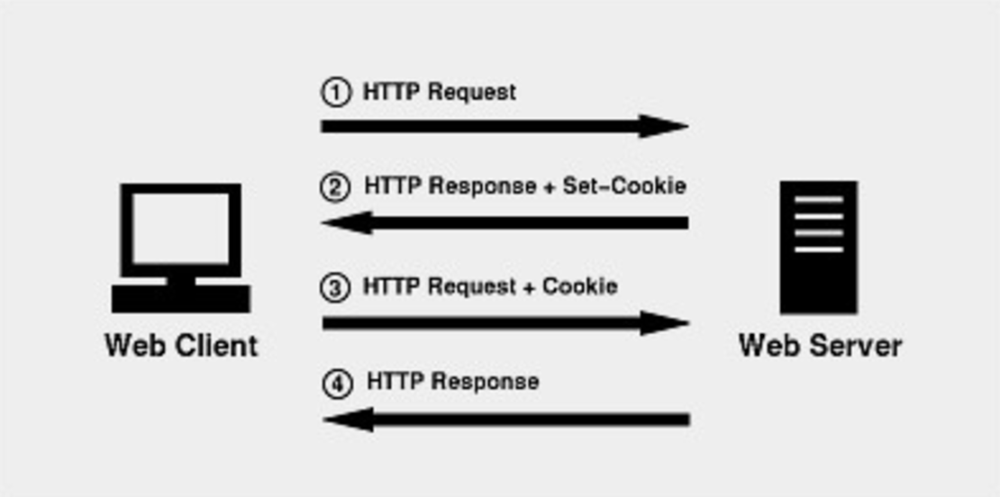
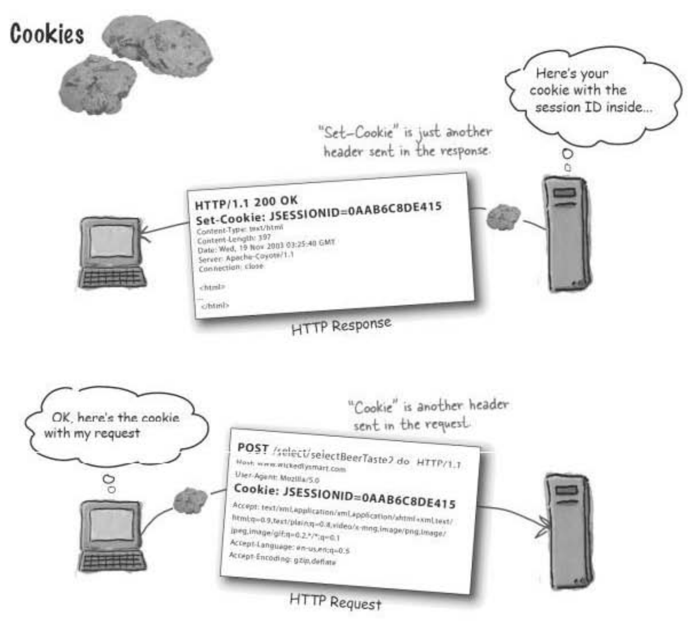
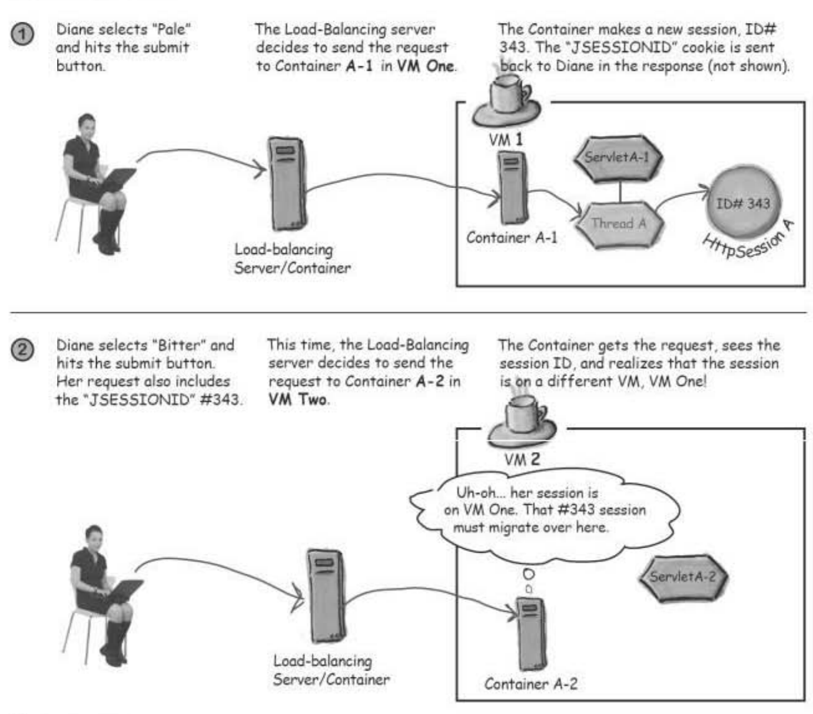
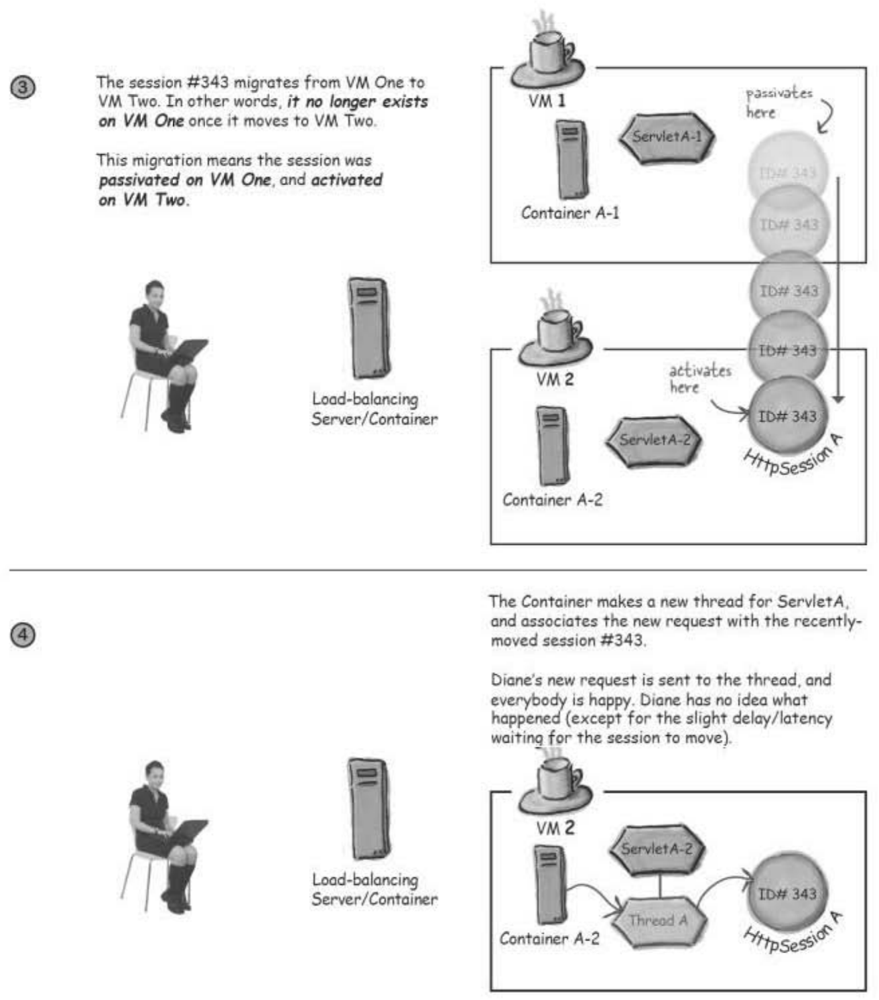

# 06. 세션 관리

*"HTTP 프로토콜은 무상태 연결!"*

- 클라이언트는 서버에 연결을 맺고, 요청을 보낸 뒤, 응답을 받는다 → 그리고 나서 연결이 끊어짐
- 즉, 연결이라고 하는 것은 한 번의 요청과, 한번의 응답을 위해 존재한다
- 무상태인 HTTP.. 클라이어트를 구분하는 방법은? → **세션..**

HTTP 세션

- 다중 요청 간 대화 정보를 유지하기 위해 HttpSession 객체를 사용한다
- 특정 사용자의 전체 세션 동안의 정보를 유지할 수 있다
- 클라이언트가 세션이 유지되는 동안 보낸 모든 요청으로부터 얻은 정보를 여기에 저장할 수 있다

세션 동작 방식

1. 클라이언트가 제일 처음 요청을 보낼 때, 컨테이너는 클라이언트의 유일한 세션 ID를 생성한다
2. 그리고 이 값을 Response에 넣어 클라이언트로 돌려보낸다
3. 그 이후부터, 클라이언트가 요청을 보낼 때는 이 세션 ID를 함께 보낸다
4. 컨테이너는 ID를 받아보고, 일치하는 세션을 찾아 세션과 요청을 연결한다

클라이언트와 컨테이너가 세션 ID를 공유하는 방법 → 쿠키!





- Request 객체로부터 세션 ID 가져오기 & Response 객체에 세션 쿠키 보내기
    
    ```java
    HttpSession session = request.getSession();
    ```
    
    - request로부터 세션을 리턴받는다
    - 세션 ID를 생성할 때와, Response에 쿠키를 설정할 때와 코드가 같다
        - request 안에 세션 ID 쿠키가 들어있으면 ID에 맞는 세션을 찾으면 되고, 그렇지 않으면 세션ID 쿠키가 없거나 세션 ID에 일치하는 세션이 없으면 새로운 세션을 만들면 된다
    - getSession 메소드는 세션을 새로 만드는 것 뿐 아니라, 제일 처음 요청일 경우에는, Response에 보낼 쿠키도 생성한다
- 이미 만들어져 있는 세션을 원할 때는?
    
    ```java
    HttpSession session = request.getSession(**false**);
    if (session == null) {
            :
    }
    ```
    
- `HttpSession` 인터페이스

  |메소드명 | 매개변수 | 반환값 | 설명|
    |---|---|---|---|
    | getCreationTime | - | long | - 1970년 1월 1일 자정(GMT) 이후로 이 세션이 생성된 시간을 밀리초 단위로 반환한다 |
    | getId | - | String| - 이 세션의 고유 ID를 반환한다 <br/> - ID는 서블릿 컨테이너에 의해 할당이 된다 <br/> - 구현에 따라 달라진다|
    | getLastAccessedTime| - | long |- 클라이언트가 이 세션과 관련된 요청을 마지막으로 보낸 시간을 1970년 1월 1일 자정(GMT) 이후 경과된 시간(밀리초)으로 반환한다 <br/> - 컨테이너가 요청을 수신한 시간으로 표시한다 (세션과 관련된 값을 가져오거나 설정하는 것과 같이 애플리케이션이 수행하는 작업은 액세스 시간에 영향을 주지 않는다) |
    | getServletContext | - | ServletContxt| - 세션이 속한 ServletContext을 반환한다|
    | getMaxInactiveInterval | - | int| - 서블릿 컨테이너가 클라이언트 액세스 사이에 이 세션을 열린 상태로 유지하는 최대 시간 간격(초)을 반환한다<br/> - 이 간격이 지나면 서블릿 컨테이너가 세션을 무효화한다 <br/>  - 최대 시간 간격은 setMaxInactiveInterval 메소드로 설정할 수 있다 <br/> - 0 이하의 반환 값은 세션이 시간 초과되지 않음을 나타냅니다.
    | getAttribute | String | Object| - 지정된 이름으로 바인딩된 개체를 반환한다<br/> - 해당 이름으로 바인딩된 개체가 없으면 null을 반환한다
    | getAttributeNames | - | Enumeration<String>|- 이 세션에 바인딩된 모든 개체의 이름을 포함하는 String 개체의 열거형을 반환한다
    | setAttribute | String, String  | -| - 지정된 이름을 사용하여 이 세션에 객체를 바인딩한다<br/> - 같은 이름의 객체가 이미 세션에 바인딩되어 있으면 객체가 변경된다<br/> - 이 메서드가 실행된 후 새 객체가 HttpSessionBindingListener를 구현하면, 컨테이너가 HttpSessionBindingListener.valueBound를 호출한다<br/> - 그런 다음 컨테이너는 웹 애플리케이션의 HttpSessionAttributeListeners에 알린다<br/> - HttpSessionBindingListener를 구현하는 이 이름의 이 세션에 객체가 이미 바인딩된 경우, 해당 Ht tpSessionBindingListener.valueBound 메서드가 호출된다<br/> - 전달된 값이 null이면 removeAttribute()를 호출하는 것과 같은 효과가 있다
    | removeAttribute | String | -| - 이 세션에서 지정된 이름으로 바인딩된 개체를 제거한다<br/> - 세션에 지정된 이름으로 바인딩된 개체가 없으면 이 메서드는 아무 작업도 수행하지 않는다<br/> - 이 메서드가 실행된 후 개체가 HttpSessionBindingListener를 구현하면 컨테이너가 HttpSessionBindingListener.valueUnbound를 호출한다<br/> - 그런 다음 컨테이너는 웹 애플리케이션의 HttpSessionAttributeListeners에 알린다
    | setMaxInactiveInterval | int | -| - 서블릿 컨테이너가 이 세션을 무효화하기 전에 클라이언트 요청 사이의 시간(초)을 지정한다 <br/> - 간격 값이 0 이하이면 세션이 시간 초과되지 않아야 함을 의미한다
    | invalidate | -| -| - 이 세션을 무효화한 다음 바인딩된 모든 개체의 바인딩을 해제한다
    | isNew | -| boolean|- 세션이 이미 있었는지/새로 만들어진건지 알 수 있는 방법 <br/> - 클라이언트가 세션에 대해 아직 알지 못하거나 클라이언트가 세션에 참여하지 않기로 선택한 경우 true를 반환한다<br/> (예를 들어, 서버가 쿠키 기반 세션만 사용하고 클라이언트가 쿠키 사용을 비활성화한 경우 각 요청에서 세션이 새로 생성된다)
    | getSessionContext (deprecated) |- | HttpSessionContext|
    | getValue (deprecated) | String | Object|
    | getValueNames (deprecated) |- | String[]|
    | putValue (deprecated) | String, String| -|
    | removeValue (deprecated) | String | -|
    
- 세션이 종료되는 경우
    1. 타임아웃
    2. invalidate() 메소드를 실행한 경우
    3. 어플리케이션 다운

### 쿠키

- 서버에서 사용자 PC에 저장하는 작은 기록 정보 파일
- 서버와 클라이언트 간 이름/값 쌍으로 쿠키를 교환한다
- 클라이언트의 상태 정보를 클라이언트 PC에 저장했다가, 필요 시 정보를 참조하거나 재사용할 수 있다
- 특징
    - 이름, 값, 만료일(저장 기간 설정), 경로 등으로 구성된다
    - 하나의 도메인 당 20개의 쿠키를 가질 수 있다
    - 하나의 쿠키는 4KB(=4096byte)까지 저장 가능하다
    - 클라이언트에 총 300개의 쿠키를 저장할 수 있다
- 구성
    - Name
        - 쿠키의 이름
    - Value
        - 쿠키 값
    - Expires
        - 쿠키 만료시간
        - 지정된 만료일이 되면 디스크에서 쿠키가 제거된다
        - 쿠키에 만료일이 포함되어 있으면 persistent cookie로 간주한다
            - Session Cookie : 브라우저가 종료되면 쿠키를 삭제한다
            - Persistent Cookie : 파일로 저장되어 브라우저 종료와 관계없이 사용한다
    - Domain
        - 쿠키가 사용되는 도메인을 지정한다
    - Path
        - 쿠키를 반환할 경로를 결정
    - Secure
        - ssl 채널 연결 시에만 쿠키를 전송하도록 설정한다
        - Secure Cookie : 웹브라우저와 웹서버가 HTTPS로 통신하는 경우에만 웹브라우저가 쿠키를 서버로 전송하는 옵션
    - HttpOnly
        - 자바스크립트를 이용해 쿠키에 접속하는 것을 막는 옵션이다

### 서블릿 API로 쿠키 사용하기

- HTTP Request와 Response에서 쿠키 관련 헤더 정보를 핸들링할 수 있다

```java
Cookie cookie = new Cookie("username", name);
cookie.setMaxAge(30*60);
response.addCookie(cookie);

:

Cookie[] cookies = request.getCookie();
for (int i = 0; i<cookiews.length; i++) {
		Cookie cookie = cookies[i];
		if (cookie.getName().equals("username")) {
				String userName = cookie.getValue();
				:
		}
}
```

- 분산 환경에서의 세션
    - 어플리케이션은 다중 JVM에서 구동된다
    - 동일 클라이언트가 보낸 요청이 동일 서블릿의 서로 다른 인스턴스로 넘어간다
    즉, 요청 A가 VM A상의 서블릿 A로 갈수도 있고, 요청 B가 VM B에 돌아가는 서블릿 A로 갈 수도 있다
    - ServletContext는 VM당 하나, ServletConfig는 VM 당, 서블릿 당 하나.. → Session은 웹 어플리케이션 당 하나
    ⇒ HttpSession 객체와 속성은 하나의 VM에서 다른 VM을 옮겨간다
    - 분산 환경에서는 한 VM에서 세션을 비활성화 시키고, 다른 VM에서 이를 활성화한다
        
        
        
    
        
    - 세션 이동과 직렬화
        - 컨테이너는 직렬화가 구현된 속성을 추가적인 코드가 없어도 옮길 수 있어야 한다
        → 즉, 직렬화하면 추가적인 작업이 필요하지 않다
        - 하지만 직렬화가 되지 않았다면, 속성 객체를 `HttpSessionActivationLisnster`로 구현한다
        - 그 다음, 활성화/비활성화 콜백 메소드를 가지고 이동할 수 있게 하면 된다
        - 세션 관련 리스너들
            - `HttpSessionActivationListener`
                - 세션의 활성화/비활성화 알림 이벤트를 수신하기 위한 인터페이스
                - `sessionDidActivate(HttpSessionEvent)` : 컨테이너가 세션을 다른 VM으로 옮기고 난 다음, 세션의 getAttribute()를 호출하기 바로 직전에 호출되어 속성들이 리턴될 준비를 한다
                - `sessionWillPassivate(HttpSessionEvent)` : 컨테이너가 세션을 다른 VM으로 옮기려고 할 때, 세션이 옮겨지기 바로 전에 호출되어 세션이 갖고 있는 속성들도 옮길 준비를 한다
            - `HttpSessionListener`
                - 세션 수명주기 변경에 대한 알림 이벤트를 수신하기 위한 인터페이스
                - `sessionCreated(HttpSessionEvent)`
                - `sessionDestroyed(HttpSessionEvent)`
            - `HttpSessionBindingListener`
                - `valueBound(HttpSessionBindingEvent)`
                - `valueUnbound(HttpSessionBindingEvent)`
            - `HttpSessionAttributeListener`
                - `attributeAdded(HttpSessionBindingEvent)`
                - `attributeRemoved(HttpSessionBindingEvent)`
                - `attributeReplaced(HttpSessionBindingEvent)`
- 분산 환경에서의 세션 공유 방법들..
    - Sticky Session
        - 첫 request에 대한 응답을 준 서버에 sticky하게 붙어있게 한다
        - 특정 세션의 요청을 처음 처리한 서버로만 보낸다
        - 예) L4 switch가 제공하는 기능 중에는, 특정 timeout이 만료되기 전까지는 계속해서 동일한 서버에 요청을 전송하는 방식인 Sticky 옵션이 존재한다Sticky 옵션을 켜면 사용자가 세션을 특정 서버에서 인증받았을 때, 다음 요청도 계속해서 같은 서버로 전송하게 된다
        - 하지만, 특정 서버에 부하가 집중될 수 있다는 치명적인 단점이 존재한다
    - Session Clustering
        - 각 서버가 자신이 가진 세션을 다른 서버에서도 가지도록 동기화한다
        - 서버끼리 자신의 세션을 공유하고, 사용자가 세션 인증을 받았던 서버가 어떤 서버였는지에 관계없이, 모든 서버가 사용자 세션에 대한 정보를 가지고 있기 때문에 세션이 없는 서버에 대한 서비스 요청으로 걱정할 일이 없다
        - 각 서버가 직접 세션을 가지고 있기 때문에 중간에 네트워크 I/O같은 부가적인 작업을 통해 세션을 가져올 필요가 없다
        
        **단점**
        
        > *By all-to-all, we mean that every session gets replicated to all the other nodes in the cluster. This works great for smaller clusters, but we don't recommend it for larger clusters — more than 4 nodes or so.
        
        all-to-all은 모든 세션이 클러스터의 다른 모든 노드에 복제됨을 의미합니다. 이것은 소규모 클러스터에 적합하지만 노드가 4개 이상인 대규모 클러스터에는 권장하지 않습니다.*
        > 
        - 서버가 자신이 가지고 있는 세션을 다른 서버에도 동일하게 갖도록 하기 위해 다른 모든 서버와 1:1 통신을 하면서 세션을 복제한다
        - 서버의 수가 적으면 적은 통신 횟수로도 서버 간 세션 공유가 가능하지만, 서버의 개수가 늘어날수록 통신의 횟수가 기하급수적으로 증가한다
        → 서버가 자체적으로 세션을 소유함으로 인해 얻는 이득보다 손해가 더 클 수 있다
        - 세션의 동기화에 걸리는 시간차로 인해 세션 불일치가 발생할 수 있다
        - 동일한 세션의 복제본을 많은 서버에서 공유하기 때문에 효율적인 메모리 관리가 되지 않는다
    - In-memory DB
        - 각 서버가 세션을 소유하는 것이 아니라, DB에 저장한다
        그리고 필요할 때 DB에서 조회하는 형태로 세션을 사용한다
        - 디스크 기반의 데이터베이스를 사용하면 I/O 작업에서 병목이 있을 수 있기 때문에, 그보다 더 나은 성능을 보여주는 메모리 기반의 in-memory DB를 사용한다
        - 더 이상 세션의 동기화는 문제가 되지 않는다
        애초에 하나의 원본 세션만 존재한다
        - 서버의 개수가 많아진다 하더라도 서버 간 세션을 공유할 필요가 없기 때문에, 서버의 규모가 클 때에도 성능 저하로 걱정할 필요가 없다
        - 세션을 들고 오는 작업에 대한 비용이 물론 서버의 개수가 증가할수록 함께 증가하지만,
        서버의 개수가 증가할수록 세션 클러스터링이나 Sticky Session에서 발생하는 성능 저하에 비교하면 훨씬 효율적이다

[https://velog.io/@minosmlee/Tomcat-HTTP-HTTPS-간-전환-시-Secure-Cookie-이슈](https://velog.io/@minosmlee/Tomcat-HTTP-HTTPS-%EA%B0%84-%EC%A0%84%ED%99%98-%EC%8B%9C-Secure-Cookie-%EC%9D%B4%EC%8A%88)

[https://souljit2.tistory.com/71](https://souljit2.tistory.com/71)