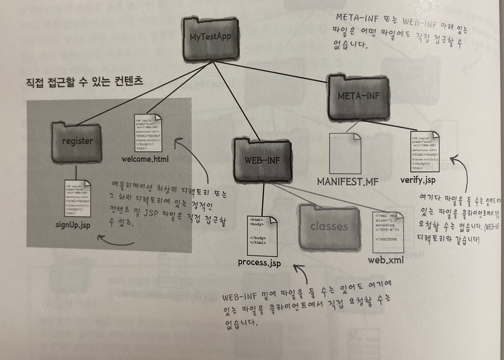
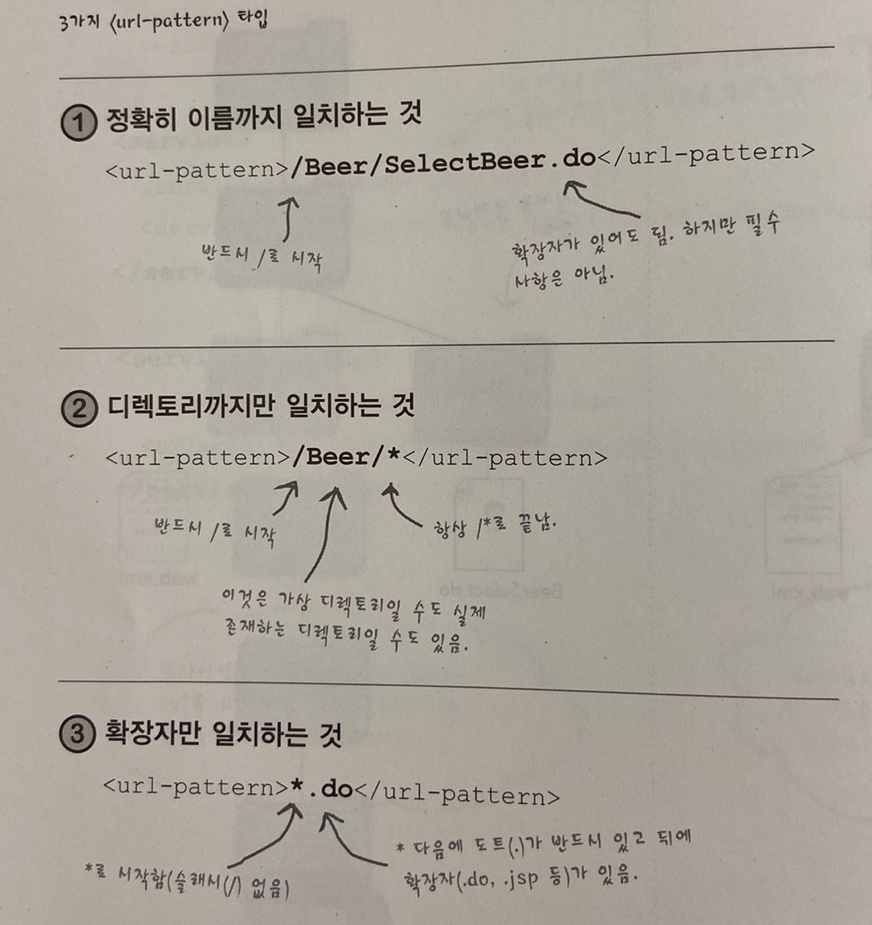

# #11 웹 애플리케이션을 배포해보자

## war 파일

- war파일은 웹 애플리케이션 구조에 대한 이식성이 좋음
- 압축된 스냅샷. 사실상 jar 파일과 같음 jar 파일과 다른점은 전체 웹 애플리케이션 컨텍스트 디렉토리가 아닌 WEB-INF 바로 위에서 압축한다는 것
- jar와 달리 실제 컨텍스트 이름이 포함되지 않기 때문에 war는 컨테이너별로 컨텍스트 이름을 구별하는 방법이 각각 다름
- 톰캣의 경우 war 파일의 이름이 웹 애플리케이션의 이름이 됨 (컨텍스트 이름)
- jar파일과 동일하게 war파일은 기존에 지켰던 web.xml의 위치 등등 모든것이 일치해야함
- war파일로 배포하는 경우 META-INF/MANIFEST.MF 파일을 통해 라이브러리 의존성을 설정할 수 있음
- MANIFEST.MF 파일의 의존성을 컨테이너가 제공할 수 없다면 배포 시점에 오류가 남

`manifest.mf`

```
Manifest-Version: 1.0
Ant-Version: Apache Ant 1.7.0
Created-By: Apache Ant
Extension-List: WeblogicSpring
WeblogicSpring-Extension-Name: weblogic-spring
WeblogicSpring-Specification-Version: 12.1.2.0.0
WeblogicSpring-Implementation-Version: 12.1.2.0.0
```

- war파일을 tomcat/webapps 디렉토리에 옮겨놓고 톰캣을 실행하면 쉽게 배포할 수 있음

## 보안

- 클라이언트가 url 상으로 직접 자원에 접근하지 못하게하려면 WEB-INF 또는 META-INF 파일 내부에 자원을 위치시켜야함




## Q & A

- WEB-INF/lib 디렉토리에 있는 jar파일, 이 jar 파일 안에 있는 컨텐츠에는 컨테이너가 어떻게 접근하죠?
  - 컨테이너는 자동으로 jar 파일을 자신의 classpath에 포함함. 마치 WEB-INF/classes 디렉토리에 배포된것과 똑같이 사용할 수 있음
  - 기억할만한 점은 WEB-INF/lib에 있는 jar 파일에서 클래스를 찾기 전에 WEB-INF/classes 디렉토리에서 먼저 찾는다는 점

## 서블릿 매핑

- 서블릿 매핑은 논리적인것.
- 클라이언트가 웹 애플리케이션의 실제 물리적인 구조에 대해서는 알 필요가 없음
- 서블릿 매핑을 하기 위해서는 웹 애플리케이션(서블릿)이 실제로 있는 물리적인 디렉토리 및 파일 구조, 그리고 다른 하나는 가상/논리적은 구조




- 컨테이너는 아래 순서대로 url을 선택함
  1. 정확하게 일치하는 경우
  2. 디렉토리까지만 일치하는 경우
  3. 확장자만 일치하는 경우
- 둘 이상의 디렉토리가 일치하는경우
  - /foo/bar/\*, /foo/\* 중에 /foo/bar/\* 를 선택함


## DD에 환경파일 설정하기

- DD파일에서 http://www.oreilly.com 이라고 입력해도 특정 자원 이름 (ex: home.html) 을 노출하지 않고 index 페이지를 설정할 수 있음

`web.xml`

```xml
<welcome-file-list>
  <welcome-file>index.html</welcome-file>
  <welcome-file>index.htm</welcome-file>
  <welcome-file>index.jsp</welcome-file>
  <welcome-file>default.html</welcome-file>
  <welcome-file>default.htm</welcome-file>
  <welcome-file>default.jsp</welcome-file>
</welcome-file-list>
```

- 특정 디렉토리 (ex: http://www.oreilly.com/foo/bar) 로 접근해도 /foo/bar 내부에 `welcome-file` 이 있다면 해당 파일을 보여줌
- 가장 먼저 일치하는 파일 순서대로 선택
- 일치하는 파일이 없다면 컨테이너마다 다르게 동작함 ex: 404 Not Found 등등 ..


## DD에 오류 페이지 설정하기


**모든 예외 사항에 적용되는 오류 페이지 정의**

```xml
<error-page>
     <exception-type>java.lang.Throwable</exception-type>
     <location>/WEB-INF/error/errorPage.jsp</location>
</error-page>
```

- 패키지명을 포함해야함

**예외 상황별로 오류 페이지 정의**

```xml
<error-page>
    <exception-type>java.lang.NullPointerException</exception-type>
    <location>/WEB-INF/error/errorPage.jsp</location>
</error-page>
```

**HTTP 상태 코드별로 오류 페이지 정의하기**

```xml
<error-page>
    <error-code>404</error-code>
    <location>/WEB-INF/error/errorPage.jsp</location>
</error-page>
```


## DD에서 강제로 서블릿 초기화하기

- 서블릿은 최초 요청이 들어올 때 초기화함
- 첫번째 요청한 클라이언트가 클래스 로딩, 인스턴스화, 초기화 등등의 작업을 도맡고 service()를 호출함
- DD의 `<load-on-startup>` 을 사용하면 최초 요청이 올 때 초기화하는 것이 아니라 배포 시점에 서블릿을 로딩할 수 있음

```xml
     <servlet>
        <servlet-name>HelloServlet</servlet-name>
        <servlet-class>servlet.HelloServlet</servlet-class>
        <load-on-startup>1</load-on-startup>
     </servlet>
```

- `<load-on-startup>` 은 0보다 큰 값일 경우 배포 시에 로딩하라는 의미이고 값이 작은 순서부터 먼저 로딩함으로써 순서를 제어할 수 있음
- `<load-on-startup>` 값이 같다면 정의된 순서대로 초기화


## DD에서 MIME타입 매핑하기

```xml
<mime-mapping>
  <extension>zip</extension>
  <mime-type>application/zip</mime-type>
</mime-mapping>

<mime-mapping>
  <extension>hwp</extension>
  <mime-type>application/unknown</mime-type>
</mime-mapping>
```


