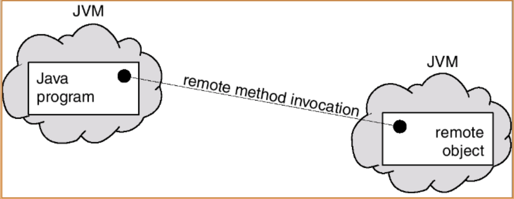
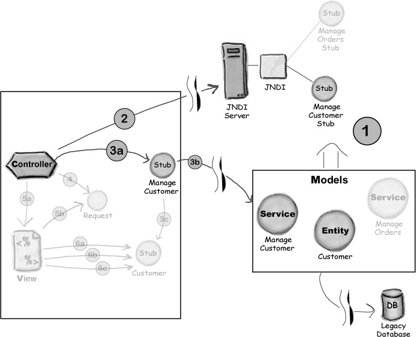
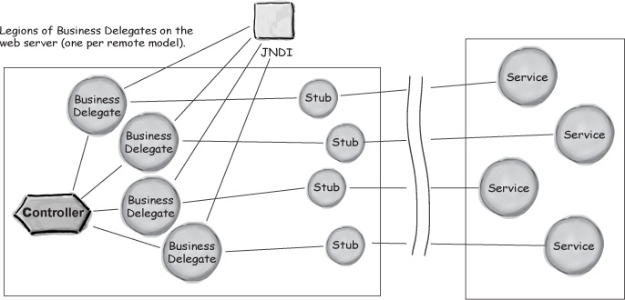
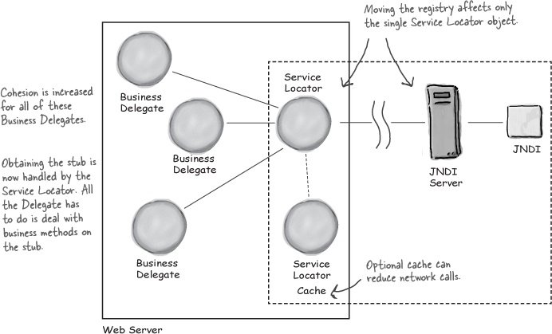
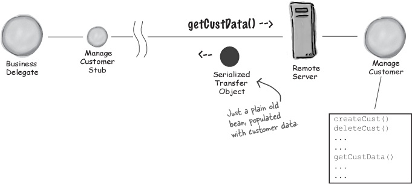
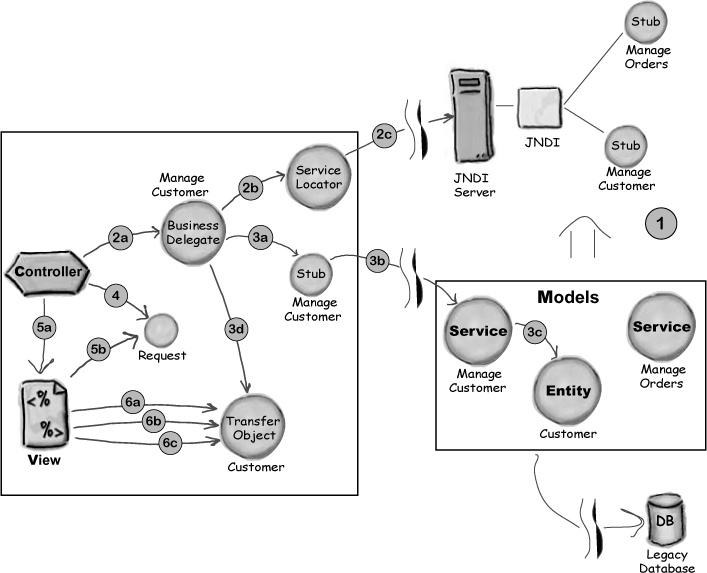
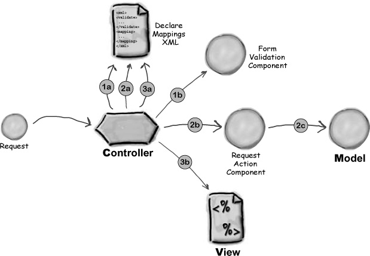
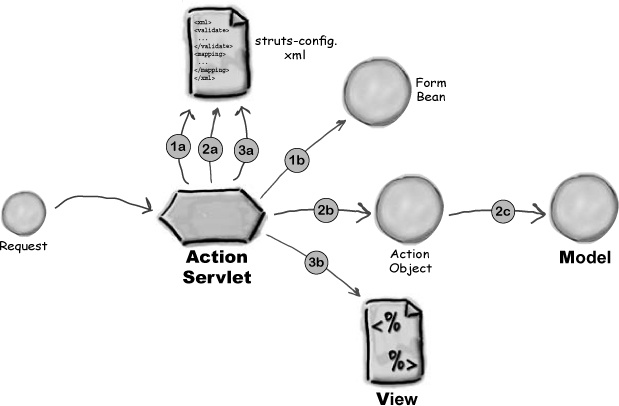

# 14.  패턴과 스트럿츠

### non-functional 요구사항

- 웹 어플리케이션 개발에서 가장 중요한 것은 최종 사용자에게 신뢰성 있는, 유용한, 정확한 소프트웨어를 제공하는 것이다
- 기능적인 요구사항 말고도, 우리는 아래와 같은 질적인 요구사항을 충족해야 한다
    - 성능
    - 모듈화
    - 유연성
    - 확장성
    - 유지보수성

### 디자인 패턴

- 디자인패턴이란, 일반적으로 발생하는 소프트웨어 문제를 해결하기 위한 반복적인 해결방식이다

**디자인 원칙**

- 인터페이스를 사용하라
- 관심 영역의 분리 및 응집성
    - 소프트웨어의 특정 기능만 특화시켜서 컴포넌트화한다
    - 개발하기가 쉽고 유지보수가 편하며, 재사용성을 높일 수 있다
    - 응집도가 높아진다
    (응집도 : 하나의 단위 작업, 목적에 얼마나 충실한가)
- 느슨한 결합도
    - 두 클래스가 서로에 대해 알아야 할 것이 적으면 적을수록, 결합도는 낮아진다
- 복잡성을 숨겨라
    - 시스템 컴포넌트를 단순화할 수 있다
- 선언적인 제어를 사용하라
    - 주로 배포 서술자에서 대부분 이뤄진다
    - 코드수정 없이 배포서술자를 수정하는 것만으로 시스템 행동을 바꿀 수 있다
    


자꾸 복잡해져가는 웹 어플리케이션..
모델 컴포넌트를 웹 어플리케이션과 다른 곳, 즉 원격지로 옮기고 싶다면..?

### 원격 프록시

- 프록시는 실제 서비스 객체와 통신하는데 필요한 모든 복잡한 내용을 내부에 숨긴다
- 원격 객체처럼 행동하는 클라이언트 객체
- 원격지에 있는 객체인 양 행동한다

  
    

### 원격 모델 컴포넌트를 지원하기 위한 패턴

**어떻게 원격 객체를 다룰까**

J2EE는 객체가 네트워크를 통하여 서로 대화하는데 필요한 2가지 매커니즘을 제공한다

- *"원격 객체를 어떻게 찾아낼 것인가"* ⇒ 원격 객체가 어디있는지 파악한다
- *"어떻게 메소드를 호출할 것이냐"* ⇒ 지역 객체와 원격 객체 간 저수준 네트워크 I/O 커뮤니케이션을 제어한다

**JNDI와 RMI**

JNDI

- Java Naming & Directory Interface
- 네이밍 및 디렉토리 서비스에 대한 API를 제공한다
- 네트워크에 존재하는 어떤 것에 대한 위치를 제공한다
(예, 네트워크를 통해 접근해야 하는 객체가 있다면, JNDI에 객체를 등록하면 된다. 다른 프로그램이 이 객체가 필요하다면 JNDI에서 객체를 검색해서 찾으면 된다)

RMI

- Remote Method Invocation
- 다른 JVM 에 있는 원격 객체를 호출하면서도 마치 지역 객체 메소드를 호출하는 것과 같은 환경을 제공한다
- RMI가 일을 해내는 방법
    1. 서버 측은 RMI를 사용해서 프록시 하나를 만들고(스켈레톤) 레지스트리에 등록한다
    2. 클라이언트는 레지스트리를 검색해서 원격 프록시의 복사본을 얻는다
    3. 그리고 나서 마치 실제 객체에 대하여 메소드를 호출하듯이 원격 프록시(스텁) 메소드를 호출한다
    
    
    

**JNDI 및 원격 관리의 복잡성을 숨겨보자**

문제

1. 컨트롤러가 JNDI 검색을 핸들링해야 한다
2. 컨트롤러는 원격 예외 사항을 포함한 원격에 관련된 모든 문제로부터 자유롭지 못하다

일반적인 해결방법 ⇒ 중개자

- 컨트롤러가 원격 객체를 직접 호출하는 것이 아니라 중개자를 통해서 호출하도록 한다

**비즈니스 델리게이트**



1. 요청을 받은 다음, JNDI 검색을 한다
2. 스텁을 리턴받는다
3. 비즈니스 메소드를 호출한다
4. 원격 예외사항을 처리 또는 제거한다
5. 컨트롤러에 값을 리턴한다

⇒ 반복 작업 발생!

**서비스 로케이터**

- 비즈니스 델리게이트에 서비스 로케이터를 도입하면, JNDI 검색하는 코드의 중복을 피할 수 있다
- 일반적으로 J2EE 어플리케이션에서는 대부분의 컴포넌트가 동일한 JNDI 서비스를 사용한다
따라서 서비스 로케이터 하나당 하나의 레지스트리를 관리하도록 하는 방식을 많이 사용한다
- 비즈니스 델리게이트에서 레지스트리 검색 코드 부분을 따로 떼내고,
비즈니스 메소드만 처리하는 방식은 비즈니스 델리게이트의 응집성을 높인다



**트랜스퍼 오브젝트**

- 비즈니스 서비스를 API로 제공하는 경우 트랜스퍼 오브젝트를 일반적으로 사용한다
- 비즈니스 서비스는 많은 인스턴스 변수를 포함하고 있는 직렬화된 자바 객체를 사용하며 이런 객체를 트랜스퍼 오브젝트라고 부른다



**비즈니스 델리게이트 내부**

```java
try {
		Customer c = custStub.getCustData(custId);
} catch (RemoteException re) {
		throw new CustomerException();
}
```

- 사실 내부적으론 트랜스퍼 오브젝트가 직렬화되고 전송된 다음,
역직렬화되어 클라이언트 로컬 JVM 메모리 힙으로 들어간다
- 이제 이 객체는 다른 지역 빈과 동일한 녀석이 된다

**비즈니스 티어 패턴**



1. 서비스를 JNDI에 등록한다
2. 비즈니스 델리게이트와 서비스 로케이터를 사용해서 JNDI에서 고객관리 스텁을 얻는다
3. 비즈니스 델리게이트와 스텁을 사용하여 Customer 빈을 얻는다
(여기서 Customer 빈은 트랜스퍼 오브젝트)
4. request에 빈 참조를 추가한다
5. 컨트롤러는 요청을 jsp로 넘긴다
jsp는 request 객체에서 Customer 트랜스퍼 오브젝트 참조를 얻는다
6. jsp는 원래 요청한 의도대로 필요한 Customer 트랜스퍼 오브젝트의 프로퍼티 정보를 EL로 추출하여 페이지를 완성한다

컨트롤러의 3가지 주요 업무

- 요청 파라미터를 읽고 다루는 작업
    - 발전된 처리 방식 : 폼 검증 컴포넌트로 분리한다
    - 폼 검증 컴포넌트가 수행하는 작업?
        - 폼 파라미터를 읽고
        - 값을 변환하고 검증하며
        - 검증 오류를 처리하여
        - 파라미터 값으로 새로운 객체를 만드는 작업을 수행
- 모델을 호출하는 작업
    - 하드코딩 없이 선언적으로 호출할 수 있는 작업 → 커스텀 배포 서술자에 모델을 정의하여 컨트롤러가 읽을 수 있도록 함
- 뷰로 디스패치 하는 작업
    - 하드코딩 없이 선언적으로 호출할 수 있는 작업 → 커스텀 배포 서술자에 요청 url을 따라 컨트롤러가 어떤 뷰로 디스패치할 것인지 판단한다

### **상상 속의 컨트롤러**



1. 컨트롤러가 요청을 받으면, XML 파일에서 해당 폼 검증 컴포넌트가 어떤 것인지 찾는다
그 다음 폼 검증 컴포넌트를 하나 띄우고 요청을 넘겨 처리를 의뢰한다
처리 중 뭔가 오류를 발견했다면, 컨트롤러에게 어떤 뷰로 요청을 넘기라고 알려준다
2. 컨트롤러는 XML 파일 선언 내용으로 요청 액션 컴포넌트가 어떤 녀석인지 파악한 다음 이를 실행한다
이 컴포넌트는 모델을 호출한다
3. 컨트롤러는 XML 파일 선언 내용으로 뷰가 어디있는지 찾은 다음 이를 실행한다

### **스트럿츠**

- 프레임워크의 일종



**주요 컴포넌트**

- 액션 서블릿
    - 어플리케이션 당 하나만 있으면 된다
    - 스트럿츠가 제공한다 (직접 작성할 필요X)
- 폼 빈
    - 역할 : 사용자가 입력한 폼 데이터를 검증한다
    - 스트럿츠가 좋은 이유 : 검증 절차 자체가 아키텍처 내에 포함되어 있다는 것
    - 어플리케이션이 처리해야 하는 HTML 폼당 하나씩 작성해야 한다
    - 스트럿츠 액션 서블릿 폼 빈의 setter를 호출하면, 자동으로 빈의 validate 메소드를 호출한다
    - 데이터 변환 또는 오류 핸들링을 할 수 있음
    
    ```java
    @Getter
    @Setter
    public class BeerSelectForm **extends ActionForm** {
    
        private static final String VALID_COLORS = "amber,dark,light,brown";
    
        private String color;
    
    		// 액션 서블릿이 validate를 호출한다
        @Override
        public ActionErrors validate(ActionMapping mapping, HttpServletRequest request) {
            final ActionErrors errors = new ActionErrors();
            if (VALID_COLORS.indexOf(color) < 0) {
                errors.add("color", new ActionMessage("error.colorField.notValid"));
            }
            return errors;
        }
    }
    ```
    
- 액션 객체
    - 디스패처
    - 액션 서블릿이 액션 객체를 띄워, execute 메소드를 호출한다
    - `execute()` : 폼 파라미터를 검증하고, 모델 컴포넌트를 호출하는 일을 한다
    
    ```java
    public class BeerSelectAction **extends Action** {
    
    		// ActionMapping -> 액션 서블릿에서 설정함. 여기에 이 정보에 기초해서 적절한 뷰를 리턴하면 됨
        @Override
        public ActionForward execute(**ActionMapping mapping**, ActionForm form, HttpServletRequest request, HttpServletResponse response) throws Exception {
            BeerSelectForm myForm = (BeerSelectForm) form;
    
            final BeerExpert be = new BeerExpert();
            ArrayList result = be.getBrands(myForm.getColor());
            request.setAttribute("styles", result);
            return **mapping.findForward("show_results")**; // 어떤 뷰로 요청을 넘길지 알려준다 (structs-config.xml 파일의 forward)
        }
    }
    
    ```
    
- structs-config.xml
    - 스트럿츠에만 있는 배포 서술자 파일
    - 요청 url을 액션에, 액션을 폼 빈에, 액션을 뷰에 매핑한다
    
    ```xml
    :
    <strcuts-config>
    		<form-beans>
    				<form-bean name="selectBeerForm" type="com.example.web.BeerSelectForm" />
    		</form-beans>
    		<action-mappings>
    				<action
    						path="/SelectBeer"
    						type="com.example.web.BeerSelectAction"
    						name="selectBeerForm"
    						scope="request"
    						validate="true"
    						input="/form.jsp">
    						<forward name="show_results" path="/result.jsp"/>
    				</action>
    		</action-mappings>
    </strcuts-config>
    ```
    

→ 컨트롤러가 하는 일이 적어진다

*사실 스트럿츠는 가장 좋은 프론트 컨트롤러 패턴의 예제!*

**프론트 컨트롤러**

- 웹 어플리케이션 프레젠테이션 티어를 하나의 컴포넌트로 제어한다
- 프론트 컨트롤러를 사용하면 어플리케이션 모든 요청이 바로 이 하나의 컴포넌트로 통하여 어디로 갈지 제어가 가능해진다

**스트럿츠가 프론트 컨트롤러에 추가한 8가지 기능**

- 선언적인 제어
    - 스트럿츠는 요청 URL, validation 객체, 모델 생성하는 객체, 뷰 간의 선언적인 매핑을 가능하게 한다
- 자동화된 요청 디스패칭
    - Action.execute()를 실행하면 ActionForward를 리턴한다
    - ActionForward는 ActionServlet이 어느 뷰로 디스패치해야하는지에 대한 정보를 가지고 있다
- DataSource 관리
- 커스텀 태그 : 수십 개의 커스텀 태그를 제공한다
- 국제화 지원
- 선언적인 검증
    - 스트럿츠는 validation 프레임워크를 제공한다
    - 폼 빈에 검증 메소드를 코딩할 필요가 없다
    - XML에 폼을 검증하는 규칙을 설정하여 폼 빈 코드를 수정하지 않고도 규칙을 변경할 수 있다
- 전역 예외처리
    - DD에 있는 <error-page>와 비슷한 오류 처리 매커니즘을 제공한다
- 플러그인
    - 스트럿츠 어플리케이션 기능을 확장하기 위하여 플러그인을 자체 제작할 수 있다 (PlugIn 인터페이스)